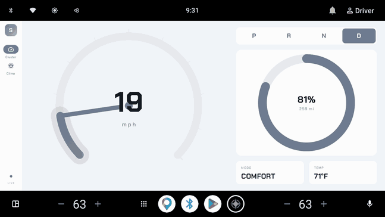
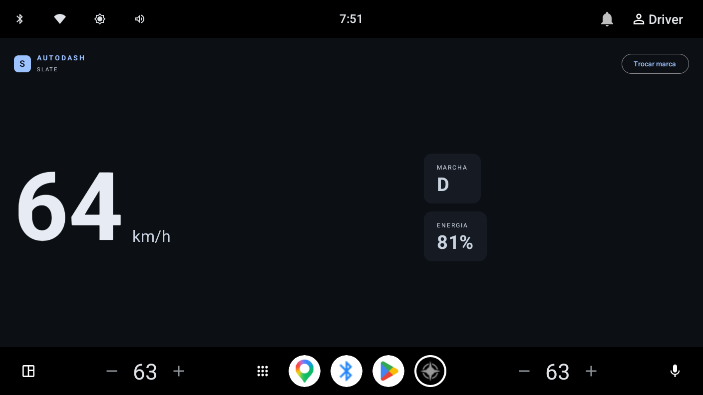
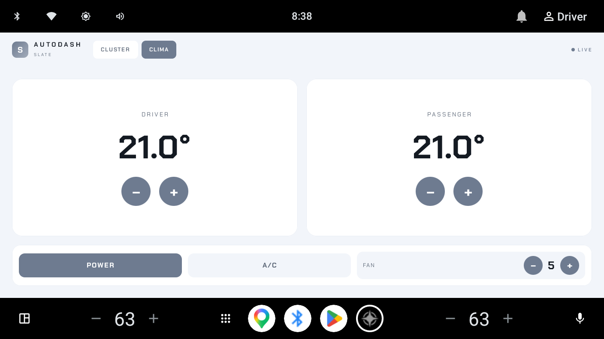
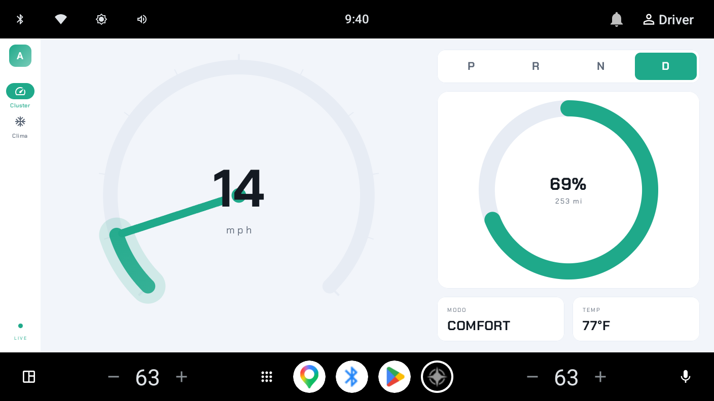
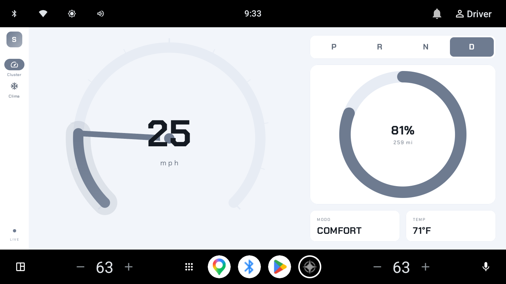

# 🚗 AutoDash — Android Automotive (AAOS) que também é um curso

App **Android Automotive** real, multi-módulo em **Clean Architecture**, **white-label** e
**responsivo** — e ao mesmo tempo um **curso**: **cada pasta tem um `README.md`** explicando o
*micro* (o que o node faz) e o *macro* (o conceito de Android Automotive que ele ensina).

> **AAOS ≠ Android Auto.** Este app roda **no head unit do carro** (Car API/VHAL), não é o
> celular projetando a tela. Detalhe em [`docs/01`](docs/01-aaos-vs-android-auto.md).

## 🎬 Demo (emulador AAOS)



*Cluster com velocímetro animado (needle) → aba **Clima** (`NavigationRail`) → **POWER off**: as
zonas, o A/C e o FAN **apagam e desabilitam** — feedback claro do estado na tela.*

**Como foi feito (resumo):** multi-módulo **Clean Architecture** (`feature → domain ← data`, tudo
sobre `core`); o **domínio é puro** (sem `android.car`) e fala com o veículo por um `CarRepository`
— na demo um `FakeCarRepository` (roda em qualquer emulador, sem permissão de carro); em produção,
o `CarPropertyRepository` (`CarPropertyManager` + `VehiclePropertyIds`) sem tocar a UI. **UI**
Jetpack Compose (Canvas p/ o velocímetro, Material3, `NavigationRail`, `Switch`, `FilledIconButton`),
**white-label** por *design tokens* + **flavors** de marca, **i18n** (km/h×mph por região) e
**testes** unit + snapshot + template. Cada pasta tem um `README.md` explicando o *micro* e o *macro*.

## 📸 Como está

**Cluster** — velocímetro (Canvas: arco + ticks + needle + animação), anel de bateria,
seletor P‑R‑N‑D, autonomia/temperatura, tema **dia/noite**, i18n:



**Clima** — HVAC **por zona** (motorista/passageiro) + **POWER / A/C / FAN**, escrevendo no
veículo via `setProperty` por `area`:



**White-label** — a mesma tela, marcas diferentes (só os *tokens* mudam). Nenhuma OEM
hardcoded; a marca é fixa **por build**:



## O que o app faz
- **Cluster (parked-optimized):** telemetria ao vivo (velocidade, marcha, energia, autonomia,
  temperatura) lida do veículo via `CarPropertyManager`. Compose, responsivo, dia/noite.
- **Clima:** HVAC por **zona** com temperatura por assento + power/AC/fan — leitura e
  **escrita** de propriedades do veículo (mostra a permissão `CONTROL_CAR_CLIMATE`).
- **POI + Navegação (dirigível):** lista de POIs (`ListTemplate`) → detalhe (`PaneTemplate`) →
  **navegação** (`NavigationTemplate` + `NavigationManager` + `Trip`) pela **Car App Library**.

## Skills da vaga cobertas
| Área | Onde |
|---|---|
| Kotlin + Jetpack Compose | todo o app |
| Clean Architecture · MVVM · SOLID | `domain` (puro), `data`, `feature`, `core` |
| **Android Automotive** (Car API, VHAL, zonas, permissões) | `data/car`, `feature/climate`, `docs/02`,`04` |
| **Car App Library** (templates, host, navegação) | `feature/carapp` + `docs/03` |
| CarUxRestrictions / distração | `docs/05` |
| **Design system multi-brand · dynamic theming (white-label)** | `core/designsystem` + `docs/06`,`09` |
| **Responsivo** portrait/landscape | `feature/dashboard` (`isWide`) |
| **i18n / l10n** (km/h×mph, °C×°F, strings) | `core/model` + `res/values-*` |
| **Testes** unit + snapshot multi-brand + template | `*/src/test` (JUnit, Paparazzi, Robolectric+car.app) |
| Performance / power / garage mode | `docs/07` |

## 🌐 i18n na prática
`en-US` → **mph / mi / °F** e rótulos em inglês; `pt-BR` → **km/h / km / °C**. Sem `if` no
código: unidade por *resource* de região, rótulos por `strings.xml`.



## Árvore (cada node tem README)
```
autodash-automotive/
├── docs/            → o curso: um .md por conceito de AAOS (01–10)
├── app/             → módulo de APP (manifest automotivo, categorias, chrome/nav)
├── core/
│   ├── model/       → modelos + i18n (VehicleSpeed, Gear, Climate, UnitSystem)
│   ├── common/      → utilidades (dispatchers)
│   └── designsystem/→ white-label: BrandTokens + tema dia/noite + fonte HUD
├── domain/          → use cases PUROS + CarRepository (sem android.car → testável na JVM)
├── data/
│   └── car/         → ponte com o veículo (CarPropertyManager) + FakeCarRepository
└── feature/
    ├── dashboard/   → cluster (Compose, Canvas, responsivo, i18n)
    ├── climate/     → HVAC por zona (áreas + setProperty)
    └── carapp/      → Car App Library: POI + navegação (templates)
```
Regra de dependência: `feature → domain ← data`, todos apontando para `core`. O **domínio não
conhece Android nem o carro** → regra testável sem emulador.

## ▶️ Rodar
```bash
./gradlew :app:installSlateDebug   # instala a marca "slate" (flavors: slate/aurora/ember/nord)
./gradlew test                  # unit + snapshot (Paparazzi) + template (Robolectric)
./gradlew :feature:dashboard:recordPaparazziDebug   # regenera os goldens
```
Verificado num **AVD Android Automotive (API 35)**. A demo usa um `FakeCarRepository` (roda
sem carro/permissão); para dados reais, troque por `CarPropertyRepository(Car.createCar(...))`
— a UI não muda (Clean Architecture).

## ✅ Testes
Três níveis (mapa completo em [`docs/08`](docs/08-testing-and-distribution.md)):
- **Unit (JVM)** — modelo/i18n (`ClimateTest`, `UnitsTest`), use case (`ObserveVehicleSpeedTest`) e
  **ViewModels** (`DashboardViewModelTest`, `ClimateViewModelTest`) com `kotlinx-coroutines-test`
  (troca `Dispatchers.Main`; `runCurrent` vs `advanceUntilIdle` p/ fluxos infinitos; clamps e zona).
- **Snapshot** (Paparazzi) — 4 marcas + portrait + inglês/imperial + tema claro; clima por marca +
  **`climate_power_off`/`climate_ac_off`** (prova visual do gating).
- **Template dirigível** (Robolectric + `androidx.car.app:app-testing`) — `ListTemplate` /
  `PaneTemplate` / `NavigationTemplate`.

`./gradlew test` roda tudo. Sem CI/CD, por escolha.

## 📚 O curso
Comece por [`docs/README.md`](docs/README.md) e desça a árvore módulo a módulo — cada
`README.md` amarra o código ao conceito de Android Automotive.

---
*Estudo pessoal para a vaga de Sr Android Automotive Developer. Marcas de exemplo (Slate/
Aurora/Ember/Nord) são fictícias — white-label, sem OEMs reais.*
