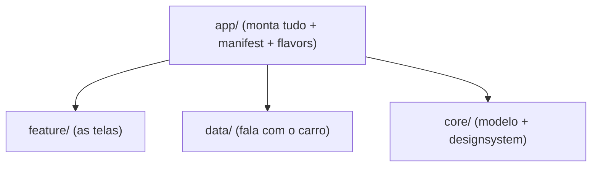

# `app/` — o módulo de aplicação Android Automotive

## 🧒 Em miúdos
Este módulo é a **capa que encaderna o livro**: sozinho quase não tem conteúdo, mas é ele
que junta todas as peças prontas (as telas, os dados, o estilo), cola o "crachá" que diz
"eu sou um app de carro" e liga tudo numa coisa só que instala e abre. É o **ponto de partida**.

> 📖 Siglas explicadas no [glossário](../docs/00-glossario.md).

**Micro:** este módulo **monta tudo** — depende dos módulos `feature/` (as telas), `data/`
(a parte que conversa com o carro) e `core/` (modelo e estilo). Ele define o
**`AndroidManifest`** (o "documento de identidade" do app: declara nome, permissões e telas),
escolhe a **marca padrão** — via **`BuildConfig.DEFAULT_BRAND`**, uma constante gerada ao
compilar que diz qual marca é este build — e traz a Activity **host** (a tela-mãe que hospeda
a interface) do dashboard.

**Macro:** é aqui que um app comum vira **automotivo** de verdade — ou seja, feito pra rodar
dentro do carro, no **AAOS** (Android Automotive OS — o Android que *é* o carro, instalado no
painel):
1. `<uses-feature android:name="android.hardware.type.automotive" android:required="true"/>`
   — declara "só rodo em carro".
2. o **`automotive_app_desc.xml`** que declara a **categoria** do app (que tipo de app
   automotivo ele é; ver `src/main/README.md`)
3. permissões `android.car.permission.*` — autorizações pra tocar dados sensíveis do carro
   (ver [`docs/04`](../docs/04-permissions-privileged.md))

Visto de cima, o `app/` só amarra os outros módulos:

## White-label (design system multi-brand)
O app **não é** de nenhuma **OEM** (Original Equipment Manufacturer — jargão para "a
montadora", tipo Volvo ou Toyota). A identidade vem de um `BrandTokens` (um conjunto de
valores de estilo com nome — cor, logo, fonte — guardados como dado) do
[`core/designsystem`](../core/designsystem) (marcas neutras: Slate/Aurora/Ember/Nord).
- **Um flavor por marca** (**flavor** = *product flavor*, uma variação do mesmo app gerada
  pelo Gradle; aparecem em **Build Variants** no Android Studio): `slate` / `aurora` /
  `ember` / `nord` (× debug/release). Cada um seta `BuildConfig.DEFAULT_BRAND`. Nomes
  NEUTROS, não OEMs reais. Trocar a identidade = trocar de flavor; produção adicionaria
  recursos/**RRO** (Runtime Resource Overlay — a montadora troca cores/imagens enquanto o
  app roda, sem recompilar) por flavor.
- **Uma marca por build** (white-label — um só código-base vira o app de várias marcas): sem
  seletor para o usuário. `AutoDashTheme` re-tematiza (re-pinta a tela toda trocando os
  tokens) a partir do `BrandTokens` — o poder multi-brand é provado por **snapshot** (uma
  foto da tela comparada com uma foto-gabarito; docs/06).

## Responsivo (portrait × landscape)
`DashboardScreen` usa `BoxWithConstraints` + `isWide()` para adaptar: **landscape** (paisagem,
tela deitada) = velocidade à esquerda, tiles à direita; **portrait** (retrato, tela em pé) =
empilhado. Head units (o "computador+tela do painel") existem nas duas orientações (**cluster**
largo — o painel de instrumentos na frente do motorista —, telas centrais retrato). Provado por
**snapshot testing** (**Paparazzi** — ferramenta que desenha a tela no PC e salva uma foto pra
comparar) em `feature/dashboard` — ver [`docs/09`](../docs/09-whitelabel-responsive.md).

## Duas superfícies
- **Dashboard** (parado, **Compose** — o kit moderno de UI do Android, que desenha a tela por
  código) → `feature/dashboard`.
- **POI** (**POI** = Point of Interest / Ponto de Interesse — um lugar no mapa, tipo posto ou
  restaurante; tela usada **dirigindo**, feita com **templates** — moldes de tela prontos que o
  carro desenha) → `feature/carapp` (um **`CarAppService`** — a porta de entrada de um app de
  carro feito com a Car App Library).

### Palavras novas
- **AAOS**, **OEM** — [o panorama: onde o app roda](../docs/00-glossario.md#1-o-panorama-onde-o-app-roda)
- **BrandTokens**, **flavor**, **RRO**, **white-label** — [cara da marca](../docs/00-glossario.md#5-cara-da-marca-white-label)
- **POI**, **template**, **CarAppService** — [telas e segurança dirigindo](../docs/00-glossario.md#3-telas-e-segurança-dirigindo)
- **Paparazzi**, **snapshot**, **cluster** — [arquitetura e testes](../docs/00-glossario.md#6-arquitetura-e-testes)
