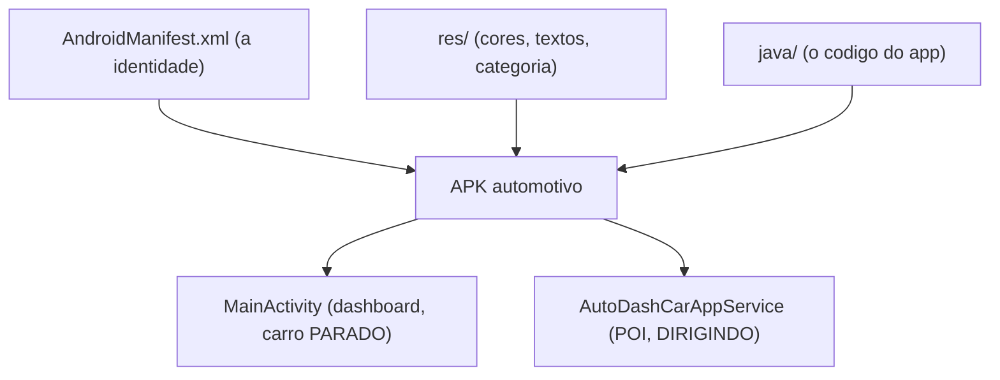

# `app/src/main/` — manifest, categorias e a fronteira automotiva

## 🧒 Em miúdos
Esta pasta é a **mala do app**: junta o documento de identidade dele, a "roupa" (cores e textos) e o miolo (o código). É aqui também que ficam os papéis que convencem o carro a deixar o app entrar no painel — sem esses papéis, o app simplesmente não aparece no veículo.

> 📖 Siglas explicadas no [glossário](../../../docs/00-glossario.md).

No **Android de celular** você já conhece esta pasta: é onde moram o manifesto, os recursos e o código. No **carro** ela ganha alguns "carimbos" a mais que dizem ao sistema do veículo "sou um app de carro, me reconheça".

**Macro — o que torna um APK "automotivo":** um **APK** (Android Package — o arquivo instalável do app, o mesmo `.apk` do celular) só é aceito no carro quando ele se declara automotivo e diz **que tipo** de app é. Isso acontece em dois arquivos:

### 1. `AndroidManifest.xml`
O **AndroidManifest.xml** é o "documento de identidade" do app: declara nome, permissões e telas.

- `<uses-feature android:name="android.hardware.type.automotive" android:required="true"/>`
  → é o carimbo "sou app de carro". Sem isso, a **Play** (Play Store) **não** distribui no carro e o **host** (o programa do carro que desenha as telas do app) não reconhece o app.
- Permissões do carro: aqui declaramos `android.car.permission.CAR_SPEED` (leitura da velocidade — um sensor básico, que app comum consegue).
  Controlar o clima exigiria **`signature|privileged`** (só apps assinados com a chave do sistema **ou** numa lista VIP da montadora) — ver [`docs/04`](../../../docs/04-permissions-privileged.md).
- Registramos **duas superfícies** (dois jeitos de o app aparecer no carro): a `MainActivity` (uma **Activity** — tela comum de Android; aqui é o dashboard rico, usado com o carro **parado**) e o
  `AutoDashCarAppService` (um **service** que serve **POI** — Point of Interest, um lugar no mapa como posto ou carregador — e roda **dirigindo**, via `feature/carapp`).
- `<uses-library android:name="android.car" .../>`: `android.car` é a biblioteca da plataforma pela qual o app fala com o carro; ela é usada por `data/car`.
- `<meta-data android:name="com.android.automotive" android:resource="@xml/automotive_app_desc"/>`: aponta para o descritor de categoria explicado abaixo.

### 2. `res/xml/automotive_app_desc.xml`
Declara a **categoria** do app — ou seja, **que tipo** de app de carro ele é. Usamos `template` (app da **Car App Library** — a biblioteca em que você **descreve** a tela e o carro a desenha, sem mexer em pixel). Poderia ser `media` para um player de música. Sem esse descritor, o carro não sabe "que tipo" de app é este.

> **Pegadinha:** esquecer o `uses-feature` **ou** o `automotive_app_desc` é o erro clássico —
> o app "some" do carro sem dar erro óbvio. Ver [`docs/08`](../../../docs/08-testing-and-distribution.md).

---

### Sobre `res/` (nós sem README próprio)
O Android proíbe arquivos não-XML dentro de `res/` (o **aapt** — a ferramenta que empacota os recursos — falha na compilação). Por isso estes nós são explicados **aqui**, não com um README dentro deles:
- **`res/`** — recursos do módulo. É o ponto de entrada do **multi-brand** (um só app, várias marcas): flavors e **RRO** (Runtime Resource Overlay — trocar cores/imagens sem recompilar o app) sobrepõem recursos; quem aplica esse RRO é a **OEM** (Original Equipment Manufacturer — a montadora, ex.: Volvo/Toyota) (`docs/06`).
- **`res/values/`** — `themes.xml` (o tema visual que o host usa) + `strings.xml` (os textos). Nunca escreva a cor "crua" no código: use o tema.
- **`res/xml/`** — `automotive_app_desc.xml`, que declara a **categoria** do app automotivo (`docs/08`).

### Palavras novas
- **APK** (Android Package — o arquivo instalável do app) — ver [glossário](../../../docs/00-glossario.md).
- **host** (o programa do carro que desenha as telas) — ver [glossário](../../../docs/00-glossario.md).
- **POI** (Point of Interest — um lugar no mapa) — ver [glossário](../../../docs/00-glossario.md).
- **Car App Library** (telas de carro sem desenhar pixel) — ver [glossário](../../../docs/00-glossario.md).
- **signature | privileged** (permissão só para app assinado / na lista da montadora) — ver [glossário](../../../docs/00-glossario.md).
- **RRO** (Runtime Resource Overlay — repintar sem recompilar) — ver [glossário](../../../docs/00-glossario.md).
- **OEM** (Original Equipment Manufacturer — a montadora) — ver [glossário](../../../docs/00-glossario.md).
