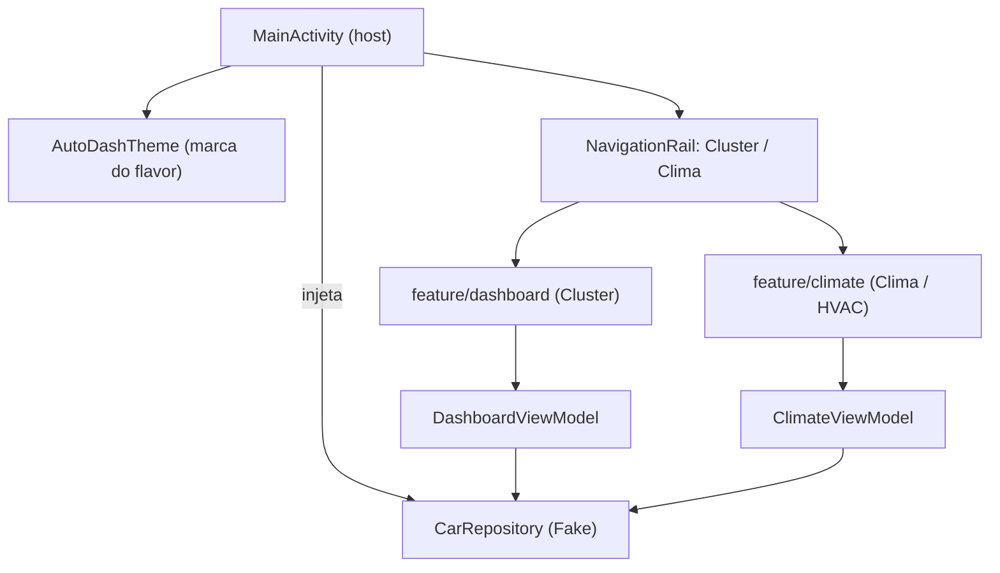

# `app/.../app/` — Application e Activity host

## 🧒 Em miúdos
Esta pasta é o **saguão de entrada** do app: acende as luzes, escolhe a "cara" da
marca e mostra um menu lateral com dois destinos — o painel e o ar-condicionado.
Ela não faz o trabalho pesado; só te recebe e te leva à tela certa.

> 📖 Siglas explicadas no [glossário](../../../../../../../docs/00-glossario.md).

## O que tem nesta pasta

**`AutoDashApplication`** — a classe **Application** (o objeto único que representa o
app **inteiro**; nasce uma vez, quando o processo sobe). Aqui ela é de propósito
**enxuta**: o `onCreate` faz o mínimo.

Por quê enxuta? O **head unit** (o computador + tela do painel do carro) liga junto
com a ignição, então o **cold start** (partida a frio — abrir o app do zero, nada em
memória) precisa ser rápido. Trabalho pesado (analytics, sync) vai **lazy/async**
(carregado só quando precisa / fora da thread da tela) ou para o **garage mode** (o
carro desligado acorda sozinho de madrugada para tarefas de manutenção) — ver
[`docs/07`](../../../../../../../docs/07-power-and-garage-mode.md). Nada de I/O de rede aqui.
É também onde a **DI** (dependency injection — injeção de dependência: entregar as
peças prontas em vez de cada classe criar as suas) seria configurada.

**`MainActivity`** — a **Activity** (a "tela-container" do Android) que **hospeda** a
interface, feita em **Compose** (Jetpack Compose — o jeito moderno de desenhar telas
Android por código). Ela é o *host*: monta o tema, cria as telas e a navegação. Faz
três coisas:

1. **Tema por marca (white-label).** Chama `AutoDashTheme(Brands.byId(BuildConfig.DEFAULT_BRAND))`.
   **White-label** (marca branca) = um só código-base que vira o app de várias
   montadoras trocando só cor/logo/fonte. **`BuildConfig.DEFAULT_BRAND`** é a
   constante gerada ao compilar que diz **qual marca** é este build; cada **flavor**
   (product flavor — variação do mesmo app gerada pelo Gradle; aqui 1 por marca) seta
   um valor. O visual em si mora no [`core/designsystem`](../../../../../../../core/designsystem/README.md).

2. **Navegação com `NavigationRail`.** A barra vertical fixa na lateral (padrão em
   tela larga de carro: alvos grandes, boa para foco/botão rotativo e para o leitor de
   tela). Dois destinos:
   - **Cluster** — o **cluster** (painel de instrumentos à frente do motorista:
     velocímetro, marcha, bateria). É a tela [`feature/dashboard`](../../../../../../../feature/dashboard/README.md).
   - **Clima** — controla o **HVAC** (Heating, Ventilation, Air Conditioning — o
     ar-condicionado/climatização do carro). É a tela [`feature/climate`](../../../../../../../feature/climate/README.md).

3. **Injeção do repositório (o Fake).** `val repo: CarRepository = FakeCarRepository()`.
   **`CarRepository`** (do módulo [`domain`](../../../../../../../domain/README.md)) é o
   **contrato** — "é assim que se pegam os dados do carro", sem dizer *como*.
   **`FakeCarRepository`** (do [`data/car`](../../../../../../../data/car/README.md)) é
   um **Fake** (dublê — implementação de mentira que roda **sem** carro real). Esse
   `repo` é passado para o `DashboardViewModel` e o `ClimateViewModel`. Um **ViewModel**
   é a peça do **MVVM** (Model–View–ViewModel) que prepara o estado; a tela só observa
   e se redesenha. Trocar o Fake pela implementação real (que fala com o carro de
   verdade) **não muda nada** aqui — é o ganho da arquitetura em camadas.

`MainActivity` é *parked-optimized* (otimizada para o carro **parado**): rica quando
parado, enxuta em movimento. Quem decide isso são as **`CarUxRestrictions`** (Car UX
Restrictions — as regras de segurança que o carro impõe à tela enquanto anda: menos
texto, sem teclado/vídeo) — ver [`docs/05`](../../../../../../../docs/05-ux-restrictions.md).

## Macro: onde este módulo se encaixa

Um app automotivo pode ter **Activity** (para experiências com o carro **parado**) **e**
um **`CarAppService`** (a porta de entrada de apps feitos com a Car App Library,
desenhados por **template** — molde pronto — e liberados para uso em **movimento**).
Aqui usamos a Activity; os dois podem conviver no mesmo app.

### Palavras novas
Todas explicadas no [glossário](../../../../../../../docs/00-glossario.md): head unit,
cold start, garage mode, DI, white-label, flavor, `BuildConfig.DEFAULT_BRAND`, cluster,
HVAC, `CarUxRestrictions`, `CarRepository`, Fake, MVVM/ViewModel, `CarAppService`, template.
