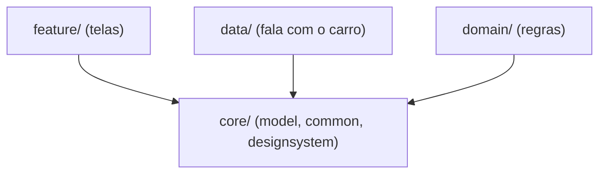

# `core/` — as fundações compartilhadas

## 🧒 Em miúdos

Imagine a **caixa de peças básicas** de uma obra: parafusos, tábuas e a paleta de tintas. Todo cômodo
usa essas peças, mas a caixa não sabe se a casa vai virar apartamento ou sobrado. O `core/` é essa
caixa: código que **todo mundo aproveita** e que, de propósito, **não sabe nada** de carro nem de celular.

> 📖 Siglas explicadas no [glossário](../docs/00-glossario.md).

**Macro:** separar o código em `core/*` — as **folhas** do grafo de dependências (ninguém abaixo delas) —
é o que permite **build por marca** (o mesmo código-base vira o app de várias montadoras, o *white-label*)
rápido e **camadas testáveis**. `feature` (as telas) e `data` (quem fala com o carro) dependem de `core`,
nunca o contrário.

Dentro dele:

- [`model/`](model) — os tipos de domínio (VehicleSpeed, Gear…) e o **i18n** (internacionalização — adaptar
  a idioma/região sem `if` no código, ex.: **km/h** no Brasil × **mph** nos EUA). **Zero Android.**
- [`common/`](common) — utilidades (dispatchers injetáveis, `Result`).
- [`designsystem/`](designsystem) — tema e **design tokens** (os valores de estilo com nome — cor, fonte —
  guardados como dado) **temáveis por marca**, prontos para **RRO** (Runtime Resource Overlay — a montadora
  troca cores/imagens enquanto o app roda, sem recompilar).

> Regra de ouro: `core:model` e `core:common` não importam Android. `designsystem`
> importa Compose (Jetpack Compose — o kit moderno de UI do Android; ou seja, é UI), mas **não** conhece o carro.

### Palavras novas

- **white-label** — um código-base, várias marcas → [glossário](../docs/00-glossario.md#5-cara-da-marca-white-label)
- **design tokens** — valores de estilo (cor/fonte) guardados como dado → [glossário](../docs/00-glossario.md#5-cara-da-marca-white-label)
- **RRO** (Runtime Resource Overlay) — re-pintar a marca sem recompilar → [glossário](../docs/00-glossario.md#5-cara-da-marca-white-label)
- **i18n** — internacionalização (km/h × mph) → [glossário](../docs/00-glossario.md#6-arquitetura-e-testes)
