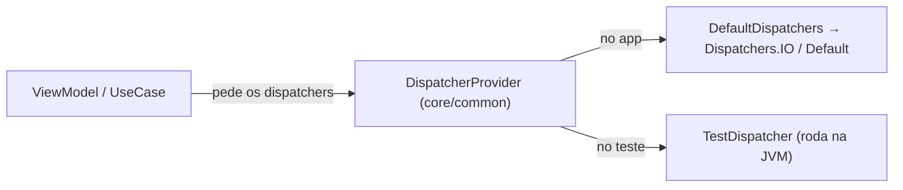

# `core/common/` — utilidades transversais

## 🧒 Em miúdos

É a caixa de ferramentas compartilhada da casa: coisas genéricas que qualquer outro módulo pega emprestado. Hoje mora aqui um único ajuste — em vez de cada tela decidir sozinha onde uma tarefa demorada vai rodar, ela recebe essa decisão pronta **de fora**. É isso que deixa o app fácil de testar.

> 📖 Siglas explicadas no [glossário](../../docs/00-glossario.md).

**Micro:** módulo de **Kotlin puro** (sem nada de Android nem do carro) para utilidades genéricas. Por ora tem só uma peça: `Dispatchers.kt`, que expõe os *dispatchers* de **corrotinas** (corrotinas — o jeito do Kotlin de rodar tarefas que "esperam", como ler um sensor, sem travar a tela; o *dispatcher* decide em qual grupo de threads a tarefa roda) por trás de uma abstração **injetável**: a interface `DispatcherProvider` e a implementação de produção `DefaultDispatchers`. Quem usa recebe os dispatchers **de fora**, em vez de chamar `Dispatchers.IO` fixo no código.

**Macro:** por que isso importa no carro? **Testabilidade.** Se o `ViewModel`/`UseCase` chamar `Dispatchers.IO` fixo, o teste vira um **teste instrumentado** (que precisa de emulador ou aparelho — lento). Injetando, o teste troca a implementação por um `TestDispatcher` (um dispatcher "de mentira", com relógio controlável) e roda direto na **JVM** (Java Virtual Machine — o "motor" que roda Kotlin no seu computador, sem device): rápido e barato (ver [`docs/08`](../../docs/08-testing-and-distribution.md)).

### Palavras novas

- **JVM** (Java Virtual Machine) — roda Kotlin no computador, sem emulador → [glossário](../../docs/00-glossario.md#6-arquitetura-e-testes)
- **corrotinas** (coroutines) — tarefas que "esperam" sem travar a tela → [glossário](../../docs/00-glossario.md#6-arquitetura-e-testes)
