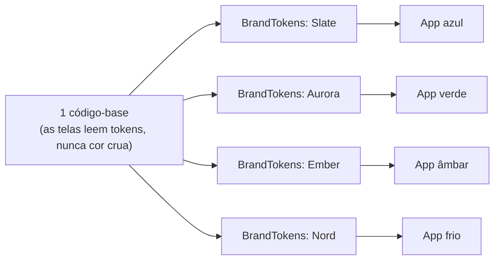

# `core/designsystem/` — design system WHITE-LABEL

## 🧒 Em miúdos

Este módulo é a **cara** do app: as cores, o fundo e a fonte. Ele guarda essa aparência como um
**dado** que dá pra trocar — como uma folha de adesivos que transforma a mesma camiseta lisa em
qualquer time. Troca a folha, o app inteiro muda de visual, sem mexer em nenhuma tela.

> 📖 Siglas explicadas no [glossário](../../docs/00-glossario.md).

**Micro:** três arquivos pequenos.
- `Brand.kt` define `BrandTokens` — os **design tokens** (valores de estilo com nome: cor primária,
  fundo, texto) guardados como **dado**, e não como cor crua escrita no meio da tela. Junto vêm
  `Brands` (o registro das marcas de exemplo) e `LocalBrandTokens` (o "canal" por onde qualquer tela
  lê a marca ativa — nome, logo).
- `Theme.kt` (`AutoDashTheme`) mapeia esses tokens para o **Material3** (Material Design 3, o kit de
  UI do Android) e ainda faz **dia/noite** (tema claro/escuro). Publicar os tokens aqui é o que deixa
  as telas lerem `MaterialTheme.colorScheme` sem conhecer marca nenhuma.
- `Type.kt` define a **fonte HUD** (HUD — Head-Up Display; o visual de painel de instrumento, com
  números grandes e alto contraste): a família `ChakraPetch`, com cara de carro, não de app genérico.

**Macro — o coração do multi-brand ("design systems for multi-brand UX", "dynamic theming"):**
- A marca é **token**, não código. Nenhuma tela conhece uma **OEM** (Original Equipment Manufacturer —
  a montadora, tipo Volvo/Toyota) específica — ela lê `MaterialTheme.colorScheme` + `LocalBrandTokens`.
  Por isso o projeto é **white-label** (marca branca — um app, várias marcas): o mesmo binário vira
  qualquer marca só trocando o `BrandTokens`.
- **Dynamic theming** (re-pintar a tela toda trocando os tokens): `AutoDashTheme(tokens)` — mudar
  `tokens` re-tematiza tudo em runtime (na prática, mudar de marca = mudar de build; o poder
  multi-brand é provado pelos snapshots).
- **RRO** (Runtime Resource Overlay — a montadora troca cores/imagens *enquanto o app roda*, sem
  recompilar) da OEM ([docs/06](../../docs/06-multi-brand-rro.md)) sobrepõe por cima, também em runtime.
- As marcas de exemplo (`Slate/Aurora/Ember/Nord`) têm nomes **neutros de propósito** — não são OEMs
  reais. Em produção, cada OEM = um **flavor** (product flavor — variação do mesmo app gerada pelo
  Gradle, aqui 1 por marca) que fornece seus tokens (+ recursos/RRO).

Cubra com **snapshot testing** (tira uma "foto" da tela e compara com a foto aprovada, pra pegar
regressão visual) por marca — `feature/dashboard` ([README](../../feature/dashboard/README.md)) tem
os testes **Paparazzi** (ferramenta que desenha a tela na JVM e salva a foto). Rodados no **CI**
(Continuous Integration — robôs que testam a cada mudança) ou com `./gradlew test` na mão, eles
barram regressão visual entre marcas sem abrir cada carro.

### Palavras novas

- **[white-label](../../docs/00-glossario.md#5-cara-da-marca-white-label)** — um app, várias marcas.
- **[dynamic theming](../../docs/00-glossario.md#5-cara-da-marca-white-label)** — re-pintar a tela toda trocando os tokens.
- **[RRO](../../docs/00-glossario.md#5-cara-da-marca-white-label)** — overlay que repinta em runtime, sem recompilar.
- **[flavor](../../docs/00-glossario.md#5-cara-da-marca-white-label)** — variação do app gerada pelo Gradle (1 por marca).
- **[OEM](../../docs/00-glossario.md#1-o-panorama-onde-o-app-roda)** — a montadora.
- **[HUD](../../docs/00-glossario.md#6-arquitetura-e-testes)** — Head-Up Display; visual de painel.
- **[Paparazzi / snapshot](../../docs/00-glossario.md#6-arquitetura-e-testes)** — foto da tela pra pegar regressão visual.
