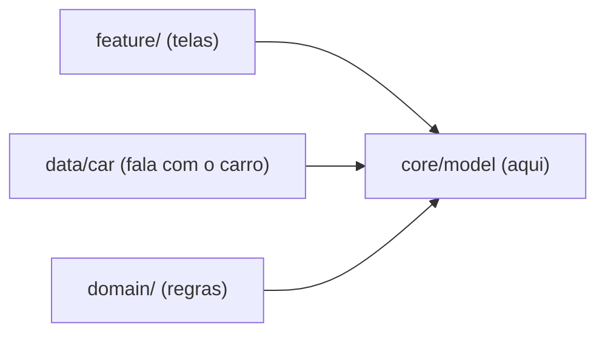

# `core/model/` — modelos de domínio (puros)

## 🧒 Em miúdos
É o dicionário de "coisas de carro" do app: velocidade, marcha, ar-condicionado, energia.
São só caixinhas de dados com nome claro — sem Android, sem tela. Todo o resto do app
aprende essas palavras aqui.

> 📖 Siglas explicadas no [glossário](../../docs/00-glossario.md).

**Micro:** `Vehicle.kt`, `Climate.kt` e `Units.kt` definem os tipos que fluem da camada de
dados até a UI (User Interface — as telas):

- **`VehicleSpeed`** — velocidade do carro. O carro entrega em m/s; aqui vira `kmh` / `mph`.
- **`Gear`** — a marcha (`PARK`, `REVERSE`, `NEUTRAL`, `DRIVE`), com rótulo curto (`"P"`, `"D"`…).
- **`Energy`** — bateria (%), combustível (litros) ou `Unavailable` (nem todo carro tem os dois —
  a ideia é degradar, não quebrar).
- **`Climate` / `Seat`** — estado do **HVAC** (Heating, Ventilation, Air Conditioning — o
  ar-condicionado do carro): temperatura do motorista × passageiro, ventilação, e as zonas de assento.
- **`UnitSystem`** — `METRIC` (km/h) ou `IMPERIAL` (mph); `unitSystemForLocale()` escolhe qual usar.

**Macro:** aqui a **Car API** (o "balcão de atendimento" com que o app pede dados ao carro; só
existe no **AAOS** — Android Automotive OS, o Android que roda *dentro* do carro) vira **domínio
limpo**. O **CarPropertyManager** (o gerente que lê, escreve e assina os dados do veículo) fala em
`Float` cru e **`VehiclePropertyIds`** (a lista de nomes oficiais das propriedades), tudo vindo do
**VHAL** (Vehicle HAL — a "ficha técnica" dos dados do carro). Nós traduzimos esse dado cru para
tipos com significado (`Gear.DRIVE`, em vez de um número solto). Assim a regra de negócio e a UI
**não** dependem do **SDK** (Software Development Kit — o kit de ferramentas) do carro — só destes modelos.

### i18n na prática (km/h × mph)
`Units.kt` guarda a regra de **i18n** (internacionalização — adaptar a idioma/região sem `if`
espalhado): o mesmo carro mostra **km/h** no Brasil e **mph** nos EUA, decidido pelo **locale**
(idioma/região do aparelho, ex.: `pt-BR`, `en-US`) — pela *região*, não pelo idioma. A conversão de
m/s → km/h/mph mora aqui, pura, então dá pra testar todos os países na JVM em milissegundos.

### Anel mais interno
Módulo **kotlin-jvm puro** (sem Android): roda em teste unitário instantâneo, sem emulador. Na
**Clean Architecture** (código em camadas; a de dentro não conhece a de fora) este é o centro —
todos apontam pra cá, ele não aponta pra ninguém:

### Palavras novas
Todas explicadas no [glossário](../../docs/00-glossario.md):
`Car API` · `AAOS` · `CarPropertyManager` · `VHAL` · `VehiclePropertyIds` · `HVAC` · `SDK` ·
`JVM` · `i18n` · `locale` · `Clean Architecture`
