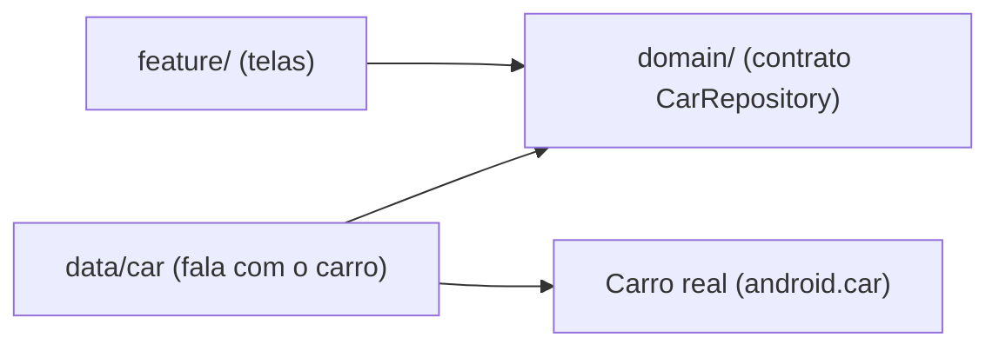

# `data/` — de onde vêm os dados

## 🧒 Em miúdos

Esta pasta é o **portão de saída** do app: é a única que conversa com o mundo lá fora. Num app de carro, esse "mundo lá fora" mais importante é o **próprio carro** — o velocímetro, o ar, a marcha. Todo pedido que precisa falar com o veículo passa por aqui.

> 📖 Siglas explicadas no [glossário](../docs/00-glossario.md).

**Macro:** a camada que fala com o mundo externo. No automotivo, o "mundo externo" mais
importante é **o próprio veículo**. Aqui vive o único módulo que importa `android.car.*` — o pacote oficial do Android para falar com o carro, que só existe no **AAOS** (Android Automotive OS — o Android que roda *dentro* do carro, não no celular).

- [`car/`](car) — wrapper do **CarPropertyManager** (Car Property Manager — o "gerente" que lê, escreve e assina os dados do veículo): implementa `CarRepository` (o contrato "é assim que se pega os dados do carro") definido no domínio.

> Isolar a **Car API** (o conjunto de comandos para o app falar com o carro) aqui é o que mantém `domain/` e `feature/` testáveis sem **emulador** (o carro de mentira que roda no PC).

Repare na direção das setas: quem depende de quem. `feature/` e `data/` **apontam para** `domain/` (usam o contrato dele); só `data/` toca o carro de verdade. Assim, trocar o carro real por um dublê não mexe nas telas.

### Palavras novas

- **AAOS** — o Android que roda dentro do carro. [glossário](../docs/00-glossario.md#1-o-panorama-onde-o-app-roda)
- **Car API / CarPropertyManager** — como o app conversa com o veículo. [glossário](../docs/00-glossario.md#2-como-o-app-conversa-com-o-carro)
- **CarRepository / emulador** — o contrato dos dados do carro e o carro de mentira para testar. [glossário](../docs/00-glossario.md#6-arquitetura-e-testes)
