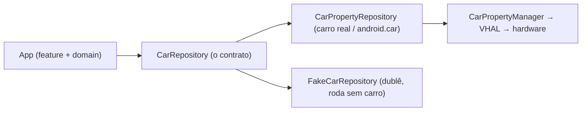

# `data/car/` — a ponte com o veículo (CarPropertyManager)

## 🧒 Em miúdos
Esta pasta é o **intérprete** entre o app e a parte elétrica do carro: o app pede "me diz a
velocidade" e ela traduz o pedido pro carro e a resposta de volta. Ela também tem um **dublê**, um
carro de mentirinha, pra o app funcionar na sua máquina mesmo sem carro nenhum na frente.

> 📖 Siglas explicadas no [glossário](../../docs/00-glossario.md).

**Micro:** `CarPropertyRepository` implementa `domain.CarRepository` (o **contrato** "é assim que se
pega os dados do carro") observando propriedades via **CarPropertyManager** (o gerente que **lê,
escreve e assina** dados do veículo) e traduzindo para modelos de `core:model`. É o **único** módulo
do projeto que importa `android.car.*` — a Car API vive só aqui, isolada do resto.

*Trocar o real pelo dublê não toca a UI:* os dois cumprem o mesmo contrato `CarRepository`.

**Macro — é aqui que a teoria da Car API vira código (ver [`docs/02`](../../docs/02-car-api-and-vhal.md)):**

A **Car API** (o conjunto de comandos pra o app **falar com o carro** — o "balcão de atendimento"
do veículo) é acessada pelo `CarPropertyManager`. Cada dado do carro é uma **propriedade** (um
valor com nome fixo, tipo `PERF_VEHICLE_SPEED` = velocidade).

- `registerCallback(cb, PERF_VEHICLE_SPEED, SENSOR_RATE_NORMAL)` → em vez de perguntar a velocidade
  toda hora, o app **assina** ("me avise quando mudar") e recebe um stream de velocidade.
- `PERF_VEHICLE_SPEED` é **CONTINUOUS** (uma propriedade que muda **o tempo todo**, segundo a
  **VHAL** — Vehicle HAL, o contrato/"ficha técnica" da montadora que diz quais dados existem e
  como mudam) → chega rápido; usamos `callbackFlow` (a ponte do Kotlin que transforma esses
  "avisos" do carro num Flow) + `conflate` (descarta valores atrasados) para não afogar a UI.
- **Sempre** checamos `CarPropertyValue.status` (AVAILABLE/UNAVAILABLE/ERROR): hardware é
  heterogêneo entre marcas — nem todo carro tem toda propriedade, então só usamos o valor quando
  ele está de fato disponível (senão a UI degrada, não quebra).
- **`awaitClose { unregisterCallback }`** → quando a tela some, cancelamos a assinatura. Sem isso,
  callback vivo em carro (que fica **ligado horas**) = **leak** (vazamento: o app fica ouvindo pra
  sempre, gastando memória/bateria). Este é o bug automotivo clássico.

**O dublê — `FakeCarRepository`:** implementa o **mesmo** `CarRepository`, mas gera sinais de
mentira (velocidade, marcha, clima) sem tocar em `android.car`. É ele que roda em **qualquer
emulador** (sem carro e sem permissão) e nos **testes**. Por isso `domain/` e `feature/` conseguem
ser testados sem carro de verdade.

**Build:** `android.car` é da **plataforma** (existe pronto no **head unit**, o computador do
painel) → entra como `compileOnly`: compilamos contra ela, mas **não** empacotamos no **APK**
(Android Package — o arquivo instalável do app). Ver `build.gradle.kts`.

> Onde entraria o power: um listener de **CarPowerManager** (o gerente de **energia** do carro)
> reagindo a `SHUTDOWN_PREPARE` (o aviso "vou desligar, salve agora") para persistir estado antes de
> suspender viria aqui (ver [`docs/07`](../../docs/07-power-and-garage-mode.md)).

### Palavras novas
- [Car API](../../docs/00-glossario.md#2-como-o-app-conversa-com-o-carro) · [CarPropertyManager](../../docs/00-glossario.md#2-como-o-app-conversa-com-o-carro) · [VHAL](../../docs/00-glossario.md#2-como-o-app-conversa-com-o-carro) · [propriedade / CONTINUOUS](../../docs/00-glossario.md#2-como-o-app-conversa-com-o-carro) · [leak](../../docs/00-glossario.md#2-como-o-app-conversa-com-o-carro) · [head unit](../../docs/00-glossario.md#1-o-panorama-onde-o-app-roda) · [CarPowerManager / SHUTDOWN_PREPARE](../../docs/00-glossario.md#7-energia-e-ciclo-de-vida)
