# 00 · Glossário ilustrado — toda sigla explicada do zero

> Você sabe fazer app de **celular** Android. Aqui é app de **carro**, que tem um mundo de siglas
> próprias. Este glossário explica cada uma **em uma frase + uma analogia**, e traz **schemas**
> (diagramas) pra você ver como as peças se encaixam. Não precisa decorar — volte quando precisar.
>
> 💡 Os diagramas abaixo são **Mermaid**: o GitHub (e a maioria dos leitores de Markdown) desenha
> eles automaticamente. Se o seu leitor mostrar o código do diagrama em vez do desenho, abra o
> arquivo no GitHub.

## Índice
- [1. O panorama: onde o app roda](#1-o-panorama-onde-o-app-roda)
- [2. Como o app conversa com o carro](#2-como-o-app-conversa-com-o-carro)
- [3. Telas e segurança dirigindo](#3-telas-e-segurança-dirigindo)
- [4. Permissões: o que o app pode tocar](#4-permissões-o-que-o-app-pode-tocar)
- [5. Cara da marca (white-label)](#5-cara-da-marca-white-label)
- [6. Arquitetura e testes](#6-arquitetura-e-testes)
- [7. Energia e ciclo de vida](#7-energia-e-ciclo-de-vida)
- [Mapa mental (tudo junto)](#mapa-mental-tudo-junto)

---

## 1. O panorama: onde o app roda

**A pergunta que resolve metade da confusão:** o app roda **no carro** ou **no celular**?

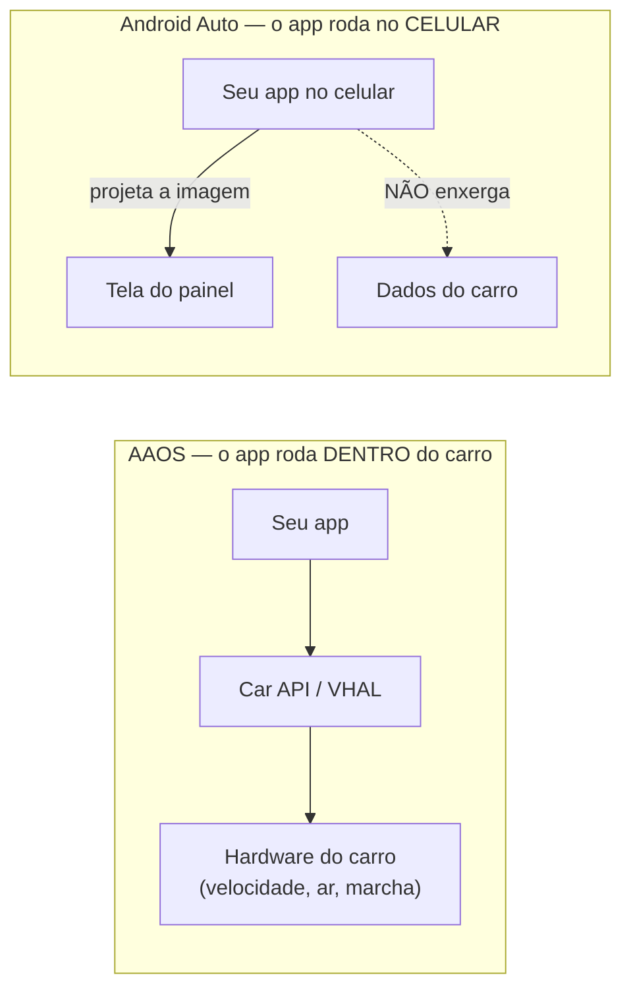

- **Carro moderno tem um computador.** A tela grande do painel (rádio, mapa, ar) é um computador
  rodando um sistema. Em muitos carros novos esse sistema é **Android** — mas uma versão feita pra
  carro, não a do celular.

- **Head unit** — é essa **tela+computador do painel**. Pense no "celular embutido no carro".
  "Roda no head unit" = "roda nesse computador do painel".

- **AAOS (Android Automotive OS)** — o Android que **É o carro**: instalado no head unit, enxerga os
  dados do veículo. Analogia: uma **smart TV** com Netflix já embutido — ela **é** o aparelho.
  ⚠️ Não confunda com o de baixo. *No projeto:* tudo aqui assume AAOS.

- **Android Auto** — o seu **celular projetando** a tela no painel. O app roda no **telefone**; o
  carro só mostra. Analogia: **espelhar o celular na TV** — a TV exibe, o telefone processa. **Não**
  enxerga os dados do carro. (AAOS ≠ Android Auto = a diferença nº 1 do curso, ver [`01`](01-aaos-vs-android-auto.md).)

- **AOSP (Android Open Source Project)** — o Android "puro", aberto e grátis. Analogia: a **receita
  base do bolo**. Toda montadora parte dele.

- **OEM (Original Equipment Manufacturer)** — jargão para **a montadora** (Volvo, Toyota…). Leia
  sempre "a montadora". É ela que monta o AAOS do carro e decide o que seu app pode fazer.

- **GAS (Google Automotive Services)** — o **combo do Google** (Play Store, Maps, Assistente) que a
  montadora *pode* licenciar por cima do AOSP. Sem GAS, a montadora traz a própria loja/serviços.

- **SDK (Software Development Kit)** — o **kit de ferramentas** pra programar pra uma plataforma
  (bibliotecas, emulador…).

---

## 2. Como o app conversa com o carro

Seu app nunca mexe no hardware direto. Ele faz **pedidos** por uma pilha de camadas, e cada camada
"traduz" pra próxima até chegar no sensor/atuador:

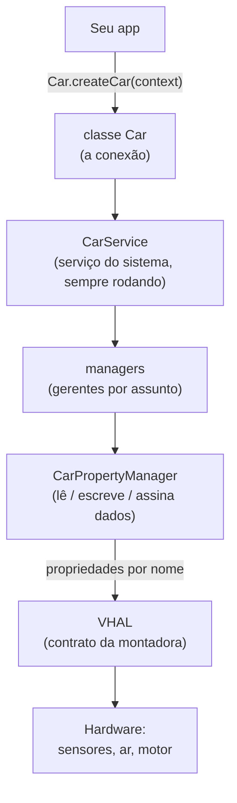

- **Car API** — o **conjunto de comandos** pra o app **falar com o carro** ("me diz a velocidade",
  "liga o ar"). Analogia: o **balcão de atendimento** do carro — você faz pedidos por ele. Só existe
  no AAOS.

- **CarService** — o **serviço do sistema** (sempre rodando) atrás do balcão, que coordena tudo. Seu
  app é **cliente** dele.

- **`Car` (a classe)** — o **objeto de conexão**: `Car.createCar(context)` "liga" o app ao
  CarService. Analogia: **pegar o telefone e discar** pro balcão.

- **manager (gerente)** — cada assunto do carro tem um gerente: `CarPropertyManager` (dados),
  `CarPowerManager` (energia), `CarUxRestrictionsManager` (segurança). Você pede o gerente certo pela
  classe `Car`.

- **CarPropertyManager** — o gerente que **lê, escreve e assina** os dados do veículo. É por ele que
  o app pega velocidade ou muda a temperatura.

- **Propriedade (property)** — **um dado ou controle** do carro, com nome fixo. Ex.:
  `PERF_VEHICLE_SPEED` (velocidade), `GEAR_SELECTION` (marcha), `HVAC_TEMPERATURE_SET` (temperatura).
  Analogia: cada propriedade é **um mostrador ou um botão** do painel.

- **`VehiclePropertyIds`** — a **lista de nomes** oficiais dessas propriedades (o "cardápio").

- **Zona / `areaId`** — algumas propriedades existem **por lugar**: temperatura do **motorista** ≠ do
  **passageiro**; pressão **por pneu**. A zona (areaId) diz **qual lugar**. Analogia: "aumenta o
  volume" (global) × "aumenta a temperatura **do lado do motorista**" (por zona). Pedir global uma
  coisa por zona = erro clássico.

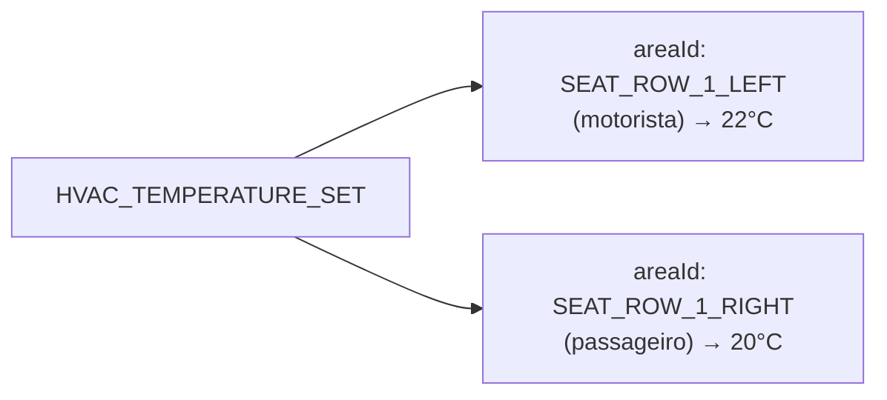

- **HAL (Hardware Abstraction Layer)** — a **camada que padroniza o hardware**. O Android fala uma
  língua só; a HAL "traduz" pro hardware. Analogia: uma **tomada padrão** — o aparelho não sabe como a
  usina gera energia.

- **VHAL (Vehicle HAL)** — a HAL **do veículo**: o contrato que a montadora implementa dizendo quais
  propriedades existem, se são de ler/escrever e como mudam. Analogia: a **ficha técnica** de cada
  mostrador/botão do carro.

- **changeMode** — como uma propriedade **muda**:

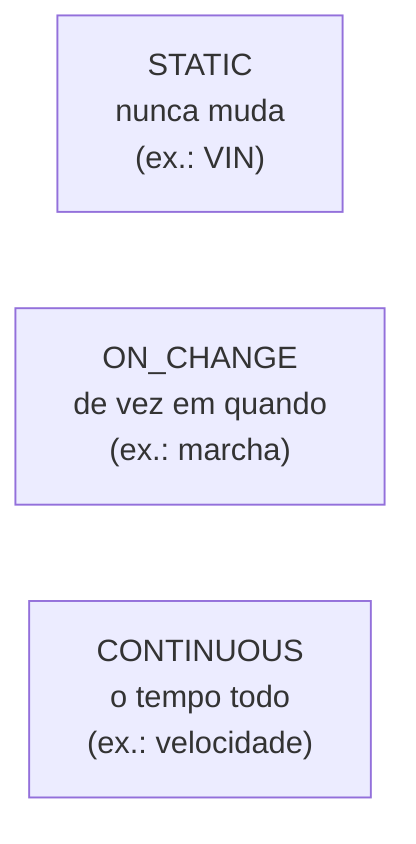

- **VIN (Vehicle Identification Number)** — o **número do chassi**, a "impressão digital" única do
  carro. Exemplo de dado `STATIC`.

- **PTO (Power Take-Off)** — uma **saída de força** do motor em veículos de trabalho (betoneira,
  guincho). Aparece só como exemplo de propriedade **específica da montadora** — não precisa saber usar.

- **EV (Electric Vehicle)** — **carro elétrico**. Ex.: `EV_BATTERY_LEVEL` = nível da bateria.

- **callback / assinar (subscribe)** — em vez de perguntar "qual a velocidade?" toda hora, você deixa
  um recado: "me avise quando mudar". O carro te chama de volta. Analogia: **assinar uma notificação**.

- **leak (vazamento) / desregistrar** — se você assina e **nunca cancela**, o app ouve pra sempre e
  gasta memória/bateria. No carro é grave (fica ligado horas). Sempre **desregistrar** quando a tela
  some. Analogia: **fechar a torneira** depois de usar. *No projeto:* `callbackFlow` + `awaitClose` em
  [`data/car`](../data/car).

---

## 3. Telas e segurança dirigindo

Com a Car App Library você **não desenha pixels**: descreve **o quê** mostrar e o **carro desenha**:

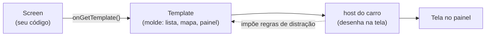

- **Car App Library** — biblioteca pra fazer apps de carro **sem desenhar pixel**: você descreve a
  tela, o carro renderiza. Analogia: você entrega um **formulário preenchido** e o carro imprime no
  padrão dele. O mesmo app roda no AAOS **e** no Android Auto, e já sai seguro pra dirigir.

- **Template (molde)** — um **layout pronto** (lista, painel, navegação). Você escolhe e preenche.
  Ex.: `ListTemplate`, `NavigationTemplate` (mapa+rota), `PaneTemplate` (detalhes).

- **host** — o **programa do carro que desenha** seus templates. Analogia: a **gráfica** que recebe o
  formulário e imprime. Também **impõe as regras de segurança**.

- **`CarAppService` / `Session` / `Screen` / `ScreenManager`** — peças da Car App Library:
  `CarAppService` é a **porta de entrada**; `Session` é a **conversa** com o host; `Screen` é **uma
  tela** (devolve um Template); `ScreenManager` é a **pilha** de telas (empilha/volta).

- **POI (Point of Interest / Ponto de Interesse)** — um **lugar no mapa** (posto, restaurante,
  carregador). "Lista de POIs" = lista de lugares.

- **CarUxRestrictions (Car UX Restrictions)** — as **regras de segurança** que o carro impõe à tela
  **enquanto anda** (menos texto, sem teclado, sem vídeo). *UX* = *User Experience*. Analogia: um
  **"modo dirigindo"** que simplifica tudo.

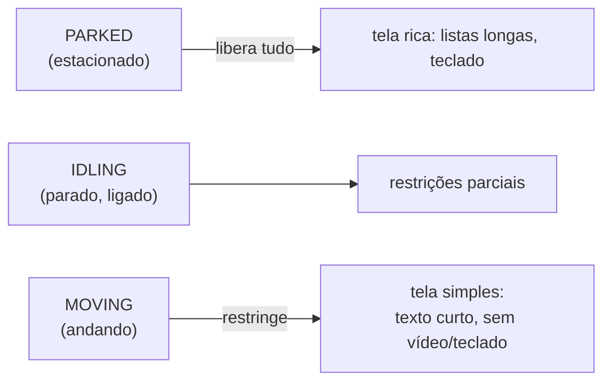

- **driving state (estado de direção)** — `PARKED` / `IDLING` / `MOVING`. A tela muda conforme o
  estado (a mesma tela tem 2 versões).

- **NHTSA** — a **agência de trânsito dos EUA** (National Highway Traffic Safety Administration). Ela
  publica as regras de "quanto a tela pode distrair" (olhar de ~2s). É a **origem legal** das
  CarUxRestrictions — você não interage com ela.

---

## 4. Permissões: o que o app pode tocar

Declarar a permissão no manifesto **não basta**. Coisa sensível exige privilégio:

```mermaid
flowchart TD
  P["Quero ler/controlar algo"] --> Q{"É sensível?"}
  Q -->|"não — ex.: velocidade"| N["normal / dangerous<br/>(app comum consegue)"]
  Q -->|"sim — ex.: ar, portas"| S["signature | privileged"]
  S --> S1["assinado com a platform key<br/>(chave do sistema)"]
  S --> S2["ou na privapp-allowlist da OEM<br/>(lista VIP)"]
  S -. "sem isso" .-> E["SecurityException 💥"]
```

- **Permissão** — autorização pra algo sensível. No carro, algumas exigem privilégio.

- **AndroidManifest.xml** — o **"documento de identidade" do app**: declara nome, permissões, telas.

- **signature (por assinatura)** — só dada a apps **assinados com a chave do sistema**. Analogia: só
  entra quem tem o **crachá da fábrica**.

- **platform key (chave da plataforma)** — a **chave secreta** com que a montadora assina o sistema.
  App assinado com ela é "de dentro".

- **privileged / privapp-allowlist** — apps de sistema numa **lista aprovada** pela montadora, em
  pasta especial, que podem tocar coisas sensíveis. Analogia: a **lista VIP** da portaria.
  `signature|privileged` = precisa da chave **ou** estar na lista.

- **3rd-party (app de terceiro)** — feito por quem **não é** a montadora. Costuma ter só leituras
  básicas; controle sensível depende de acordo com a OEM.

- **`SecurityException`** — o erro quando o app tenta algo **sem permissão**. No carro quase sempre é
  **falta de assinatura/lista** — **não** bug no seu código.

---

## 5. Cara da marca (white-label)

Um só código-base vira o app de várias montadoras, trocando só os **tokens** (cor, logo, fonte):

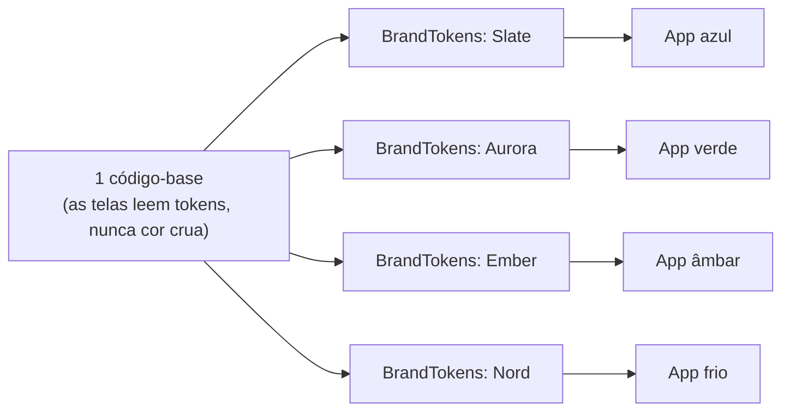

- **White-label ("marca branca")** — **um app, várias marcas**. Analogia: a **mesma camiseta lisa** que
  ganha a estampa de cada time. Nenhuma marca fica "chumbada" no código.

- **Design tokens** — os **valores de estilo com nome** (cor primária, fundo, fonte) guardados como
  **dado**. Analogia: uma **paleta de tintas rotulada**; troca a paleta, troca o visual inteiro.

- **hex hardcoded (cor "chumbada")** — escrever a cor crua na tela (`0xFF0066CC`) em vez do token. É
  ruim porque **ignora a troca de marca**. Regra: **nunca** cor crua; sempre o token.

- **car-ui-lib** — biblioteca de **componentes de tela do sistema** do carro que a montadora consegue
  **repintar**.

- **RRO (Runtime Resource Overlay)** — a montadora **troca cores/imagens/estilos enquanto o app roda,
  sem recompilar**. *Runtime* = enquanto roda; *overlay* = camada por cima. Analogia: **um
  filtro/capa** sobre o app pronto.

- **flavor (product flavor)** — uma **variação do mesmo app** gerada pelo Gradle. Aqui **1 flavor por
  marca** (slate/aurora/ember/nord). Analogia: **sabores** do mesmo sorvete-base. Aparecem em "Build
  Variants" no Android Studio.

- **`BuildConfig.DEFAULT_BRAND`** — constante **gerada ao compilar** que diz **qual marca** é este
  build. Cada flavor seta um valor; o app lê pra escolher a paleta.

- **dynamic theming** — **re-pintar a tela toda** trocando os tokens, sem mexer no layout.

---

## 6. Arquitetura e testes

**Clean Architecture:** as camadas de dentro (regras) **não conhecem** as de fora (Android/carro).
Por isso dá pra trocar o carro real por um dublê e testar tudo na sua máquina:

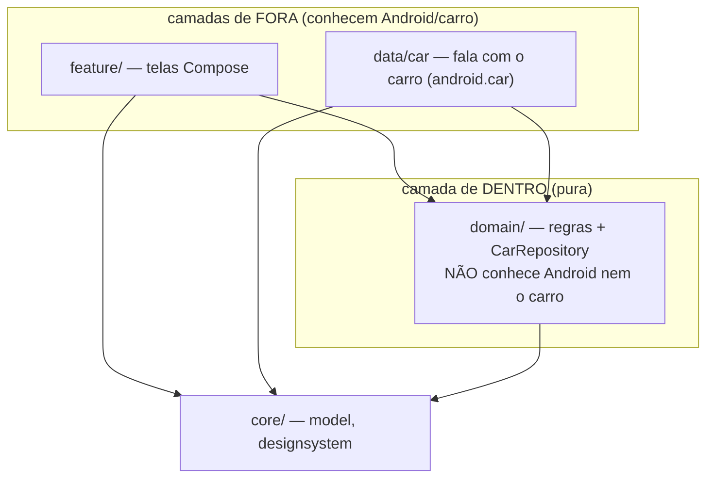

**MVVM em ação (tela de Clima):** comando desce, estado sobe — a tela nunca fala direto com o carro:

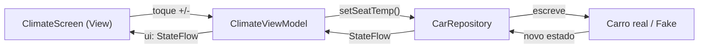

- **Clean Architecture (arquitetura limpa)** — código em **camadas**; a de dentro não conhece a de
  fora. Analogia: a **cozinha** (regras) não precisa saber qual **garçom** (tela) ou **fornecedor**
  (carro) está usando.

- **MVVM (Model–View–ViewModel)** — **View** (tela) só mostra; **ViewModel** prepara o estado;
  **Model** são os dados. Analogia: **garçom ↔ cozinheiro ↔ ingredientes**.

- **StateFlow** — um **valor que "avisa" quando muda**. A tela assina e se redesenha sozinha. Analogia:
  um **placar** que todos veem atualizar.

- **CarRepository (repositório)** — a **interface** (contrato) "é assim que se pega os dados do carro",
  sem dizer *como*. Duas implementações: **real** (`CarPropertyRepository`) e **falsa**
  (`FakeCarRepository`). Trocar uma pela outra **não muda a tela**.

- **Fake (dublê)** — implementação **de mentira** pra rodar/testar **sem o carro**. Analogia: um
  **manequim** pra provar a roupa.

**Pirâmide de testes:** muitos testes baratos embaixo, poucos caros em cima:

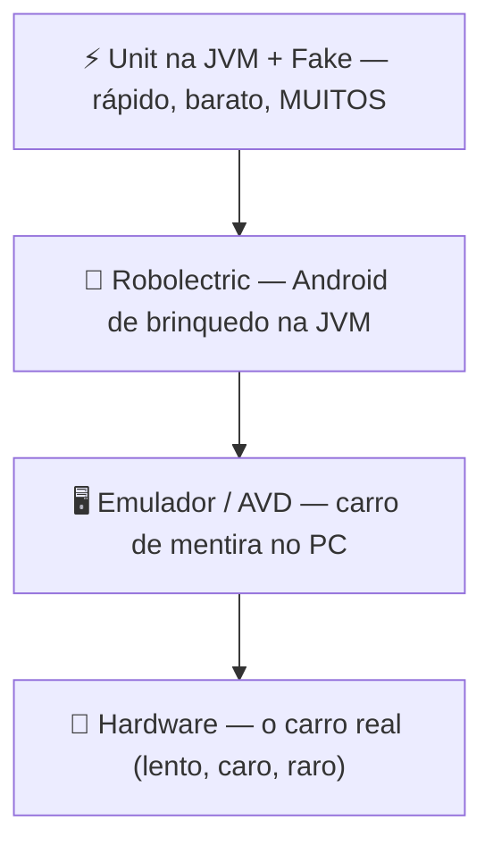

- **JVM (Java Virtual Machine)** — o "motor" que roda Kotlin/Java **no computador**, sem device.
  "Teste na JVM" = **rápido, na sua máquina**.

- **JUnit** — a biblioteca padrão pra **escrever testes**.

- **Robolectric** — roda testes que **precisam do Android** direto na JVM (sem emulador). Analogia: um
  **Android de brinquedo** só pro teste.

- **Paparazzi** — ferramenta de **snapshot de tela**: desenha a tela na JVM e salva uma **foto**.

- **snapshot test / golden** — tira uma **foto** da tela e compara com a foto aprovada (o **golden**,
  a "foto-gabarito"). Pixel mudou sem querer → o teste falha (pega **regressão visual**). Analogia: o
  **"ache o erro entre as duas figuras"** automático.

- **coroutines / corrotinas** — o jeito do Kotlin de rodar tarefas que "esperam" (ler sensor, baixar)
  **sem travar a tela**. Em teste, o tempo delas vira um **relógio de mentira** que você adianta na mão.

- **i18n / l10n** — **internacionalização** e **localização**: adaptar a idioma/região (ex.: **km/h**
  no Brasil, **mph** nos EUA) sem `if` no código. Analogia: o mesmo cardápio **traduzido** por país.

- **locale** — o **idioma/região** do aparelho (pt-BR, en-US). É ele que decide km/h × mph.

- **RTL (Right-To-Left)** — idiomas lidos **da direita pra esquerda** (árabe, hebraico); a tela
  **espelha** o layout.

- **CI/CD (Continuous Integration / Continuous Delivery)** — robôs que **testam e publicam** a cada
  mudança. **Este projeto não usa** (por escolha) — roda `./gradlew test` na mão.

- **cluster** — o **painel de instrumentos** (velocímetro, marcha, bateria) na frente do motorista. A
  tela `dashboard` é um cluster.

- **HUD (Head-Up Display)** — visual estilo painel (números grandes, alto contraste). Aqui é só o
  **estilo** da tela, não um projetor real.

- **HVAC (Heating, Ventilation, Air Conditioning)** — o **ar-condicionado / climatização** do carro. A
  tela "Clima" controla o HVAC.

- **Canvas** — a ferramenta do Compose pra **pintar a tela ponto a ponto** (linhas, arcos). O
  velocímetro do cluster é desenhado no Canvas.

- **AVD (Android Virtual Device) / emulador** — um **carro/celular de mentira** no seu computador.
  "AVD Automotive" = head unit simulado.

- **ADB (Android Debug Bridge)** — a **ferramenta de terminal** pra falar com o device (instalar app,
  tirar print). O "controle remoto" pelo terminal.

---

## 7. Energia e ciclo de vida

- **garage mode (modo garagem)** — o carro **desligado acorda sozinho** pra manutenção (baixar update,
  subir logs). Analogia: tarefas de **madrugada**, sem atrapalhar quem dirige.

- **CarPowerManager** — o gerente de **energia** (ligando, "vou dormir", suspenso). Avisa o app pra
  **salvar o estado** antes de desligar.

- **`SHUTDOWN_PREPARE`** — o aviso "vou desligar, salve agora". Você assina e persiste o que precisa.

- **cold start (partida a frio)** — abrir o app "do zero" (nada em memória). No carro importa porque o
  boot é atrelado à ignição.

- **always-on (sempre ligado)** — o sistema fica muito tempo aceso → cuidar de memória/leak; nada de
  **wakelock** (segurar o device acordado) à toa.

---

## Mapa mental (tudo junto)

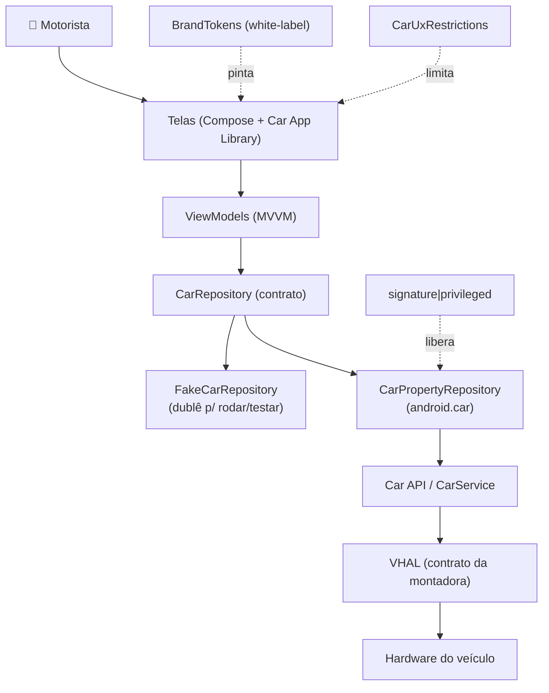

*Leitura do mapa:* o motorista usa as **telas**, que falam com **ViewModels**, que falam com o
**CarRepository** (contrato). Em produção o contrato é a implementação **real** (que desce pela Car
API → VHAL → hardware); em teste/emulador, o **Fake**. Por fora, os **tokens** pintam a marca, as
**CarUxRestrictions** limitam a tela dirigindo, e a **permissão** libera (ou não) o controle sensível.

---

*Não decore. Cada capítulo (01–10) manda você de volta aqui quando aparece uma sigla nova.*
