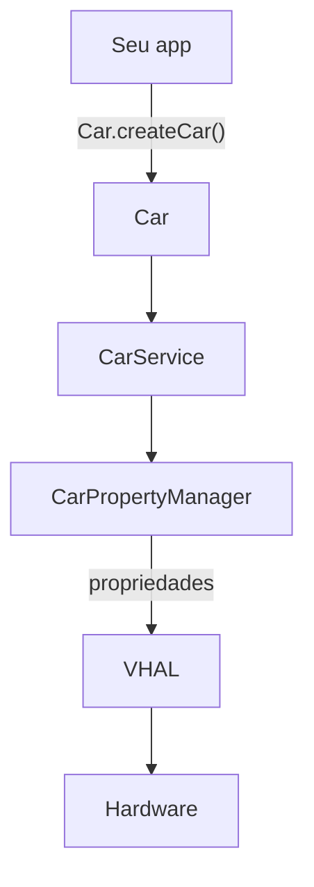

# 02 · Car API, CarPropertyManager e VHAL

## 🧒 Em miúdos
Imagine que o carro é um prédio enorme cheio de sensores e botões, e você **não** pode sair mexendo na fiação. No térreo desse prédio tem um **balcão de atendimento**: seu app chega lá e faz pedidos em linguagem simples — "me diz a velocidade", "aumenta a temperatura do lado do motorista". Um atendente vai até o equipamento certo e traz a resposta, sem você tocar em nada por baixo. E, pendurada na parede, existe uma **ficha técnica** escrita pela montadora que lista tudo que dá pra pedir e avisa, item por item, o que é só-olhar e o que dá pra mexer. Este capítulo é sobre usar esse balcão e ler essa ficha.

> 📖 Toda sigla deste capítulo está explicada no [glossário](00-glossario.md).

## A porta para os dados do veículo
Antes de pedir qualquer coisa, seu app precisa "discar" para o balcão. Esse balcão é a **Car API** (API quer dizer *Application Programming Interface* — o conjunto de comandos que o Android dá pro seu app falar com o carro; você faz pedidos por ele em vez de mexer no hardware direto). Ela só existe no **AAOS** (*Android Automotive OS* — o Android que roda **dentro** do carro).

Tudo começa em `Car.createCar(context)` → `getCarManager(Car.PROPERTY_SERVICE)`.

Traduzindo essa linha: `Car.createCar(context)` é **pegar o telefone e discar** pro balcão — ele liga seu app ao **CarService** (o serviço do sistema que fica sempre rodando atrás do balcão e coordena tudo; seu app é só um **cliente** dele). Já `getCarManager(Car.PROPERTY_SERVICE)` é pedir o **atendente certo** para o assunto "dados do carro".

Esse atendente é o **CarPropertyManager** (o "gerente" que **lê, escreve e assina** os dados do veículo). É por ele que o app pega a velocidade, muda a temperatura ou pede pra ser avisado quando algo mudar.
O **CarPropertyManager** lê/escreve/assina **propriedades** identificadas por
`VehiclePropertyIds` (`PERF_VEHICLE_SPEED`, `GEAR_SELECTION`, `HVAC_TEMPERATURE_SET`…).

Duas palavras aí merecem tradução:

- **Propriedade** (property) é **um dado ou um controle do carro**, com um nome fixo — pense em cada uma como **um mostrador ou um botão** do painel: `PERF_VEHICLE_SPEED` é o mostrador de velocidade, `GEAR_SELECTION` é a marcha, `HVAC_TEMPERATURE_SET` é o botão de temperatura do **HVAC** (Heating, Ventilation, Air Conditioning — o ar-condicionado/climatização do carro).
- **`VehiclePropertyIds`** é a **lista oficial de nomes** dessas propriedades — o "cardápio" do que dá pra pedir no balcão.

Com o atendente na mão, existem três tipos de pedido:

| Chamada | Quando |
|---|---|
| `registerCallback` | Valor muda no tempo (velocidade, marcha) — você observa |
| `getProperty` | Leitura pontual (nível atual de bateria) |
| `setProperty` | Escrever/controlar (temperatura) — **exige permissão** (ver `docs/04`) |

Lendo a tabela de outro jeito: `getProperty` é **perguntar uma vez** ("qual o nível da bateria agora?"). `setProperty` é **mandar mudar** algo e, por mexer no carro, quase sempre **exige permissão** (o assunto do [`docs/04`](04-permissions-privileged.md)). E `registerCallback` é **deixar um recado** — "me avise quando isso mudar" — em vez de ficar perguntando toda hora; o carro te chama de volta sozinho. Esse "me avise" é o **callback** (assinar/subscribe), como assinar uma notificação em vez de checar o app o tempo todo.

## Zonas (áreas)
Propriedade pode ser **global** (areaId 0) ou **por zona** (assento, roda, janela).
HVAC é por assento → passe o `areaId`. Ler global uma prop zoneada é erro comum.

Por quê isso importa? Alguns dados existem **por lugar** do carro. "Aumenta o volume" é uma coisa só, global — mas "aumenta a temperatura" precisa saber **de qual lado**: motorista ou passageiro? A pressão dos pneus é **por pneu**. Essa noção de "qual lugar" é a **zona**, e ela é identificada por um número chamado **`areaId`**. Quando `areaId` é `0`, o dado é único pro carro inteiro (global). Quando não é, você **precisa** dizer a zona no pedido — por isso o HVAC, que é por assento, exige o `areaId`. Pedir de forma global uma coisa que é por zona é um dos erros mais clássicos de quem está começando.

## VHAL (Vehicle HAL) — o contrato de hardware
Aqui entra a "ficha técnica" da história. **VHAL** (Vehicle HAL — a HAL **do veículo**) é o **contrato** que a montadora escreve dizendo quais propriedades o carro tem e como cada uma se comporta. E **HAL** (Hardware Abstraction Layer — camada que padroniza o hardware) é o que deixa o Android falar **uma língua só** enquanto ela "traduz" pro hardware específico de cada carro, como uma tomada padrão em que o aparelho não precisa saber como a usina gera a energia. Ou seja: o **VHAL** é a ficha técnica de cada mostrador e cada botão do carro, e seu app **confia** nesse contrato.

Quem escreve esse contrato é a **OEM** (Original Equipment Manufacturer — jargão para **a montadora**, tipo Volvo ou Toyota; sempre que ler "OEM", leia "a montadora").

A OEM implementa o VHAL; cada propriedade tem um *config*:
- **access:** `READ` / `WRITE` / `READ_WRITE` (`setProperty` em READ = erro).
- **changeMode:** `STATIC` (VIN), `ON_CHANGE` (marcha), `CONTINUOUS` (velocidade, com sample rate).
- **vendor properties** (grupo `0x2000_0000`): específicas da OEM (ex.: modo caminhão, PTO).

Destrinchando esse *config* (o "cadastro" de cada propriedade na ficha técnica):

- **access** é a permissão de leitura/escrita **do próprio dado**: `READ` (só-olhar), `WRITE` (só-mexer) ou `READ_WRITE` (os dois). Se você tentar `setProperty` numa propriedade marcada como `READ`, é erro na certa — é como tentar girar um mostrador que só serve pra mostrar.
- **changeMode** é **como a propriedade muda ao longo do tempo**. São três jeitos:
  - `STATIC` — **nunca muda**. Exemplo: o **VIN** (Vehicle Identification Number — o número do chassi, a "impressão digital" única do carro).
  - `ON_CHANGE` — muda **de vez em quando**, e só te avisa quando muda. Exemplo: a marcha.
  - `CONTINUOUS` — muda **o tempo todo** e vem num "fluxo" constante. Exemplo: a velocidade. Nesse caso você define o **sample rate** (a taxa de amostragem — quantas vezes por segundo você quer receber o valor; pedir depressa demais gasta bateria à toa).
- **vendor properties** são propriedades **específicas da montadora** (o grupo `0x2000_0000`), fora do cardápio padrão. Exemplo: um modo caminhão ou o **PTO** (Power Take-Off — uma saída de força do motor usada em veículos de trabalho, tipo ligar uma betoneira). Você não precisa saber operar PTO; é só o exemplo típico de "dado que só alguns carros têm".

## Sempre
- Cheque `CarPropertyValue.getStatus()` (`AVAILABLE/UNAVAILABLE/ERROR`) — hardware é heterogêneo.
- **Desregistre** o callback no fim: carro fica ligado horas → callback vivo = leak.

Por que essas duas regras são obrigatórias:

- **Cheque o status.** Nem todo carro tem todo sensor, e um sensor pode falhar. Por isso cada leitura vem com um "carimbo" de situação — `getStatus()` — que pode ser `AVAILABLE` (dado bom, pode usar), `UNAVAILABLE` (esse carro não tem/não está pronto) ou `ERROR` (deu problema). "Hardware é heterogêneo" quer dizer justamente isso: cada carro é diferente, então **nunca** confie que o número chegou — confira o carimbo antes de mostrar na tela.
- **Desregistre o callback no fim.** Se você "assinou" (deixou o recado "me avise quando mudar") e **nunca cancela**, o app continua ouvindo pra sempre e gasta memória e bateria. Isso é um **leak** (vazamento). No carro é grave, porque ele pode ficar ligado por horas. A regra é simples, como **fechar a torneira** depois de usar: quando a tela some, **desregistre** o callback.

**No projeto:** implementado em [`data/car`](../data/car) com `callbackFlow` + `awaitClose`.

Na prática, o projeto embrulha tudo isso num jeito Kotlin limpo: `callbackFlow` transforma os avisos do carro (o callback) num **fluxo** que a tela consegue "assinar", e o `awaitClose` é exatamente o **fechar a torneira** — o pedaço que **desregistra** o callback automaticamente quando ninguém está mais ouvindo, evitando o leak sem você precisar lembrar toda vez.

### Palavras novas deste capítulo

- [Car API](00-glossario.md) — balcão de comandos do app pro carro.
- [CarService](00-glossario.md) — serviço do sistema atrás do balcão.
- [CarPropertyManager](00-glossario.md) — gerente que lê/escreve/assina dados do carro.
- [Propriedade](00-glossario.md) — um dado ou controle nomeado do carro.
- [VehiclePropertyIds](00-glossario.md) — lista oficial de nomes das propriedades.
- [Zona / areaId](00-glossario.md) — qual lugar do carro (assento, roda).
- [HVAC](00-glossario.md) — ar-condicionado e climatização do carro.
- [callback](00-glossario.md) — recado "me avise quando mudar".
- [VHAL](00-glossario.md) — ficha técnica das propriedades, escrita pela montadora.
- [HAL](00-glossario.md) — camada que padroniza o hardware pro Android.
- [OEM](00-glossario.md) — a montadora / fabricante do carro.
- [changeMode](00-glossario.md) — como a propriedade muda no tempo.
- [VIN](00-glossario.md) — número do chassi, único e imutável.
- [PTO](00-glossario.md) — saída de força de veículos de trabalho.
- [leak](00-glossario.md) — assinatura nunca cancelada gastando memória/bateria.
