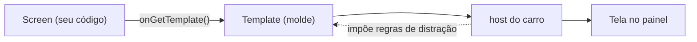

# 03 · Car App Library (apps dirigíveis por templates)

## 🧒 Em miúdos

Imagine que, em vez de pintar a tela você mesmo, você preenche um **formulário** — "aqui vai uma lista com estes itens", "aqui vai uma mensagem" — e entrega pra uma **gráfica**. A gráfica imprime tudo no padrão dela: bonito, legível e igual pra todo mundo. Neste capítulo é assim: **você preenche o formulário e o carro é a gráfica que imprime na tela**. Você nunca escolhe cor de pixel nem posição de botão — só diz *o quê* mostrar, e o carro decide *como* desenhar, inclusive cuidando pra não distrair quem está dirigindo.

> 📖 Toda sigla deste capítulo está explicada no [glossário](00-glossario.md).

## A ideia central: você descreve, o carro desenha

Num app de **celular** comum, você desenha cada tela na mão: decide onde fica o botão, a cor, o tamanho da fonte. Aqui é o contrário. Com a **Car App Library** (a biblioteca do Android pra fazer apps de carro **sem desenhar pixel** — você descreve *o quê* mostrar e o carro desenha), você monta a tela escolhendo **templates**.

Um **template** (um **molde de tela pronto** — pode ser uma lista, um painel de detalhes, uma tela de navegação) funciona como um formulário com campos em branco: você pega o molde certo e só preenche o conteúdo (o título, os itens da lista). Você **não inventa o layout do zero** — o formato já vem decidido.

Quem pega esse molde preenchido e o transforma em pixels na tela é o **host** (o **programa do carro que desenha** os seus templates — a "gráfica" que recebe o seu formulário e imprime). O host também é quem **manda nas regras de segurança**: é ele que decide, por exemplo, que a lista não pode ter itens demais enquanto o carro anda.

A grande vantagem desse arranjo: o mesmo app roda no **AAOS** (Android Automotive OS — o Android que **é o próprio carro**, instalado no computador do painel) **e** no **Android Auto** (o seu **celular projetando** a tela no painel do carro). Você escreve uma vez; cada host desenha do seu jeito. E, como é o host que desenha, a tela já sai **pronta e segura pra dirigir** — você não precisa se preocupar com isso.

## As quatro peças que montam o app

Todo app feito por templates tem quatro engrenagens. Pense numa recepção de empresa: tem a porta da frente, o atendimento que te acompanha, cada sala que você visita e a lembrança de por onde você passou.

| Peça | Papel |
|---|---|
| `CarAppService` | Ponto de entrada (declarado no manifest com a categoria) |
| `Session` | Conexão com o host; entrega a `Screen` inicial |
| `Screen` | Produz um `Template` em `onGetTemplate()` |
| `ScreenManager` | Pilha de telas (`push`/`pop`) |

Traduzindo cada linha da tabela pra linguagem simples:

- **`CarAppService`** — a **porta de entrada** do app. Ela é declarada no `AndroidManifest.xml` (o "documento de identidade" do app, onde ficam nome e permissões) junto com a **categoria** dele — se é um app de navegação, de **POI** (*Point of Interest*, ou **ponto de interesse** — um lugar no mapa, tipo um posto ou um restaurante), etc. É por essa porta que o carro encontra e liga o seu app.
- **`Session`** — a **conversa** aberta com o host, do "oi" ao "tchau". Quando ela começa, entrega a primeira **`Screen`** (a tela inicial).
- **`Screen`** — **uma tela**. A única obrigação dela é, quando o host pedir, devolver um template já preenchido no método `onGetTemplate()`. Ou seja: o host pergunta "o que eu desenho agora?" e a `Screen` responde entregando o molde.
- **`ScreenManager`** — a **pilha de telas**. Quando você abre uma tela nova, ela vai pra cima da pilha (`push`); quando volta, a de cima sai (`pop`). É o mesmo empilha-e-volta das telas que você abre e fecha num app de celular.

## Escolhendo o molde certo

Templates: `ListTemplate`, `GridTemplate`, `PaneTemplate`, `MessageTemplate`,
`NavigationTemplate`, `MapTemplate`… → escolha pela tarefa.

Cada nome é um molde pronto pra uma situação: `ListTemplate` mostra uma **lista** de itens; `GridTemplate`, uma **grade** de ícones grandes; `PaneTemplate`, um **painel de detalhes**; `MessageTemplate`, uma **mensagem ou aviso**; e `NavigationTemplate` / `MapTemplate` são as telas com **mapa e rota**. Você não mistura peças à vontade — pega o molde que combina com a tarefa e preenche.

## Restrições (distração)

Por que tantas regras? Porque olhar pra tela e dirigir ao mesmo tempo é perigoso. Por isso o host impõe **restrições de distração** — as **CarUxRestrictions** (o **UX** aí é *User Experience*, a **experiência do usuário**; são as **regras de segurança** que o carro aplica **enquanto anda**: menos texto, sem teclado, sem vídeo) — pra manter os olhos do motorista na estrada. O capítulo [`05`](05-ux-restrictions.md) entra fundo no assunto; aqui basta entender o que essas regras fazem com a sua tela:

- Profundidade máxima da pilha (**limite de passos**) — há um teto de quantas telas você pode empilhar. O caminho até o que o usuário quer precisa ser **curto**.
- Nº máx de itens por lista → consulte o `ConstraintManager` — em vez de chutar quantos itens cabem, pergunte ao **`ConstraintManager`** (o objeto que informa **os limites atuais** que o host está aplicando naquele momento). Assim você respeita o número certo sem adivinhar.
- **Refresh restrito**: só certas mudanças não contam como novo passo. Use `invalidate()` — você não pode redesenhar a tela inteira a torto e a direito. Só algumas atualizações são permitidas sem contar como um "passo novo" no fluxo. Pra pedir que o host redesenhe a tela atual com o conteúdo atualizado, você chama `invalidate()` (é o "reconstrói meu template, por favor").

Fluxos **rasos** e listas **curtas** são obrigatórios. Estourar o limite = o host recusa a **UI** (*User Interface*, a **interface** — ou seja, a sua tela): se você exagerar na profundidade ou no tamanho, o carro simplesmente **não mostra a sua tela**.

**No projeto:** [`feature/carapp`](../feature/carapp) traz um `CarAppService` + `PoiScreen`
com `ListTemplate`.

Na prática, é um mini exemplo de tudo isso: a `PoiScreen` é uma tela que lista **POIs** (aqueles **lugares no mapa** que vimos acima — postos, restaurantes, carregadores) usando o molde `ListTemplate`. Abra a pasta e veja as quatro peças acima trabalhando juntas num caso real.

### Palavras novas deste capítulo

- [Car App Library](00-glossario.md) — biblioteca pra fazer apps sem desenhar pixel.
- [Template](00-glossario.md) — molde de tela pronto pra preencher.
- [host](00-glossario.md) — programa do carro que desenha a tela.
- [CarAppService](00-glossario.md) — porta de entrada do app de carro.
- [Session](00-glossario.md) — a conversa aberta com o host.
- [Screen](00-glossario.md) — uma tela que devolve um template.
- [ScreenManager](00-glossario.md) — a pilha de telas (empilha e volta).
- [AAOS](00-glossario.md) — o Android que é o próprio carro.
- [Android Auto](00-glossario.md) — celular projetando a tela no painel.
- [POI](00-glossario.md) — um lugar no mapa (posto, restaurante).
- [CarUxRestrictions](00-glossario.md) — regras de segurança da tela dirigindo.
- [AndroidManifest.xml](00-glossario.md) — o documento de identidade do app.
