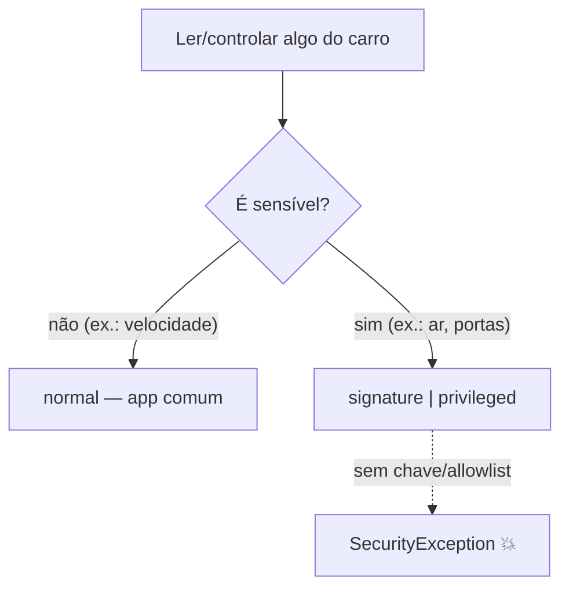

# 04 · Permissões & apps privilegiados

## 🧒 Em miúdos

Imagine um prédio com portaria. Escrever no formulário "eu quero entrar na sala tal" não abre a porta sozinho — o porteiro ainda confere quem é você. No carro é a mesma coisa: seu app pode declarar "eu quero mexer no ar-condicionado", mas só declarar não libera nada. Coisas simples, como ver a velocidade, qualquer visitante enxerga. Já mexer em coisas sérias (ar, portas, motor) exige um crachá emitido pela própria fábrica do carro, ou o seu nome numa lista VIP que a fábrica aprovou na portaria. Sem crachá e sem estar na lista, a porta bate na sua cara — e isso é regra da casa, não defeito seu.

> 📖 Toda sigla deste capítulo está explicada no [glossário](00-glossario.md).

Permissões (autorização pra o app fazer algo sensível — ler a velocidade, mexer no ar) do carro vivem num espaço de nomes próprio, `android.car.permission.*`. Você pede cada uma no **manifest** (o `AndroidManifest.xml`, o "documento de identidade" do app, onde ele declara nome, telas e tudo o que pede). Mas atenção: **declarar no manifest não basta.** No celular, pedir já é metade do caminho. No carro, pra coisas sérias, pedir é só o começo — falta o carro **reconhecer** que você tem direito.

O Android classifica cada permissão por um **nível de proteção**, que decide **quem** consegue obtê-la. Dois deles já vêm do mundo do celular: **normal** (o sistema concede sozinho, sem perguntar) e **dangerous** (pede confirmação em *runtime* — aquele diálogo "permitir acesso?" que aparece com o app rodando). No carro entram mais **dois níveis**, bem mais fechados — **signature** e **privileged**. Os quatro pontos abaixo explicam esses dois níveis novos e as duas peças que aparecem junto com eles (a chave da fábrica e quem manda na lista):

- **signature** (permissão por assinatura) — só é dada a apps **assinados com a mesma chave do sistema**. Analogia: só entra quem tem o **crachá emitido pela fábrica**.
- **platform key** (chave da plataforma) — é a **chave secreta** com que a montadora assina o sistema. Assinar seu app com ela é dizer "esse app é de dentro".
- **privileged / allowlist** (app privilegiado / lista de permitidos) — apps de sistema instalados numa pasta especial e cujo nome está numa **lista aprovada pela montadora**. É a **lista VIP** da portaria.
- **OEM** (Original Equipment Manufacturer — jargão pra a **montadora / fabricante do carro**, tipo Volvo ou Toyota; sempre que ler "OEM", leia "a montadora"). É ela que decide o que o seu app pode tocar.

A tabela resume quem alcança cada nível:

| Nível | Quem consegue |
|---|---|
| normal / dangerous | App comum (dangerous pede runtime) |
| signature | App assinado com a **platform key** |
| signature\|privileged | App de sistema **privilegiado**, na **allowlist** da OEM |

Repare que os dois de baixo se acumulam: `signature|privileged` quer dizer "precisa da chave **ou** estar na lista VIP". Na prática:

- Leituras básicas (velocidade, energia, info) podem ser concedidas a apps comuns — é a "portaria de visitante".
- **Controle** (HVAC — Heating, Ventilation, Air Conditioning, ou seja o ar-condicionado/climatização do carro; powertrain — o conjunto motor+transmissão que faz o carro andar; portas) e dados sensíveis são tipicamente
  **`signature|privileged`** → precisa da platform key **ou** estar numa
  `privapp-permissions` (o arquivo XML da "lista de permitidos", guardado em `/etc/permissions`) fornecida pela OEM.

Em outras palavras: a leitura simples é liberal; o controle e os dados delicados ficam trancados atrás do crachá de fábrica ou da lista VIP.

**`SecurityException`** (o erro que o Android dispara quando o app tenta algo **sem permissão**) ao ler/escrever uma propriedade sensível = quase sempre falta de
assinatura/allowlist, **não** bug de código. Traduzindo: o carro não te barrou porque seu código está errado, e sim porque você não tem crachá nem está na lista. A **OEM decide** o que um **3rd-party** (app de terceiro — feito por quem **não** é a montadora) pode tocar. Por isso, mudar o código não resolve; quem resolve é a montadora te colocando na lista ou te dando a chave.

**No projeto:** o `AndroidManifest.xml` do `app/` declara `android.car.permission.CAR_SPEED`
(a permissão de **ler a velocidade**, que é leitura básica). Controlar o clima exigiria privilégio — por isso essa parte fica **comentada** no manifest, como lembrete de que sozinho o app não alcança esse nível.

### Palavras novas deste capítulo

- [AndroidManifest.xml](00-glossario.md) — o "documento de identidade" do app.
- [Permissão](00-glossario.md) — autorização pra fazer algo sensível.
- [signature](00-glossario.md) — permissão só pra app assinado igual ao sistema.
- [platform key](00-glossario.md) — chave secreta com que a montadora assina o sistema.
- [privileged / allowlist](00-glossario.md) — app de sistema na lista VIP aprovada.
- [OEM](00-glossario.md) — a montadora / fabricante do carro.
- [HVAC](00-glossario.md) — o ar-condicionado / climatização do carro.
- [3rd-party](00-glossario.md) — app de fora, não feito pela montadora.
- [SecurityException](00-glossario.md) — erro que estoura quando falta permissão.
