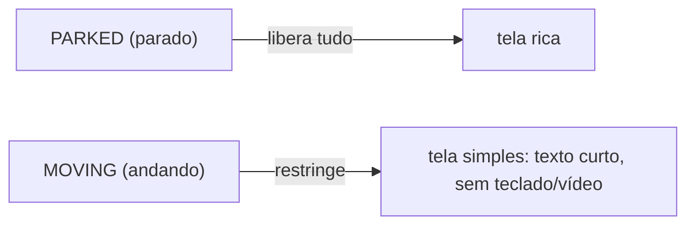

# 05 · CarUxRestrictions & distração do motorista

## 🧒 Em miúdos

Imagine que você está no banco do carona conversando com quem dirige. Com o carro **parado**, a pessoa pode olhar uma foto no seu celular, ler um texto grande, escolher um item numa lista enorme. Mas com o carro **andando**, ela só consegue dar uma espiada de um ou dois segundos — então você fala coisas curtas ou espera ela estacionar. O carro faz exatamente isso com a tela do seu app, sozinho: enquanto anda, ele esconde teclado, vídeo, textos longos e listas grandes; quando estaciona, libera tudo de novo. Seu trabalho é deixar as **duas versões** da mesma tela prontas.

> 📖 Toda sigla deste capítulo está explicada no [glossário](00-glossario.md).

## Segurança não é um detalhe — é um requisito

Segurança é **requisito**, não detalhe. No celular, ninguém está dirigindo enquanto usa seu app; no carro, pode estar. Por isso o sistema **limita sua UI** (a interface, ou seja, a tela do seu app) enquanto o carro anda. Você não escolhe se quer obedecer: o carro impõe. Essas regras têm um nome — **CarUxRestrictions** (Car UX Restrictions — as regras de segurança que o carro impõe à sua tela *enquanto anda*: menos texto, sem teclado, sem vídeo; "UX" é *User Experience*, a experiência do usuário). A analogia boa é um **"modo dirigindo"** que simplifica tudo automaticamente.

Dois "gerentes" cuidam disso (um **manager** é o gerente de um assunto do carro — você pede o gerente certo pela classe `Car`):

- **`CarUxRestrictionsManager`** (o gerente das **restrições ativas** — ele diz o que está proibido *agora*) → você **assina** (deixa um recado "me avise quando mudar") e **adapta** a tela quando ele avisa.
- **`CarDrivingStateManager`** (o gerente do **estado de direção** — em que situação o carro está) → informa o **driving state** (estado de direção): `PARKED` (estacionado), `IDLING` (parado com o motor ligado) e `MOVING` (andando).

## O que cada restrição proíbe

Quando o carro anda, o `CarUxRestrictionsManager` liga uma ou mais destas restrições. Cada uma é uma "flag" (um marcador que fica ligado ou desligado) com um nome fixo:

| Restrição | Implica |
|---|---|
| `NO_KEYBOARD` | Sem digitação livre em movimento |
| `NO_VIDEO` | Sem vídeo dirigindo |
| `LIMIT_STRING_LENGTH` | Textos curtos (há máximo) |
| `LIMIT_CONTENT` | Menos itens / menos profundidade |

Repare que não é "tudo ou nada": algumas restrições **limitam** em vez de proibir. Para essas, o carro te diz **quanto** você pode mostrar, através de três perguntas que você faz ao gerente:

`getMaxRestrictedStringLength` (quantos caracteres um texto pode ter) / `getMaxCumulativeContentItems` (quantos itens no total a tela pode listar) / `getMaxContentDepth` (quantos níveis de navegação a fundo dá pra descer)
dizem **quanto** mostrar. **Parado** libera tudo → a mesma tela tem **2 versões** (a rica, de parado; a enxuta, de andando).

## De onde vêm essas regras (a origem legal)

Isso não é capricho da montadora nem invenção do Android — é lei. Base legal: **NHTSA** (National Highway Traffic Safety Administration — a agência de trânsito dos EUA; ela publica a regra de "quanto a tela pode distrair", tipo olhar de ~2 segundos e tarefas curtas). Você nunca "fala" com a NHTSA; ela é o **porquê** das restrições existirem. Guardar a **regra do olhar de ~2s** ajuda a projetar: se uma tela exige mais que uma espiada rápida, ela não pode aparecer com o carro andando.

**No projeto:** o `dashboard` (a tela de painel do app — um **cluster**, o painel de instrumentos com velocímetro, marcha e bateria na frente do motorista) é rico **parado**; em movimento, vira **telemetria só de leitura** (só os números que o carro está medindo, sem controles pra tocar). Os **POI** (Points of Interest — pontos de interesse, ou seja, lugares no mapa: posto, restaurante, carregador) vão pela **Car App Library** (a biblioteca de apps de carro em que você descreve *o quê* mostrar e o carro desenha), que já aplica as restrições no **host** (o programa do carro que desenha seus **templates** — os moldes de tela prontos que você preenche — e, de quebra, **impõe as regras de segurança** por você). Ou seja: usando a Car App Library, boa parte do "modo dirigindo" já vem pronta.

### Palavras novas deste capítulo

- [CarUxRestrictions](00-glossario.md) — regras de segurança da tela dirigindo.
- [CarUxRestrictionsManager](00-glossario.md) — gerente que informa as restrições ativas.
- [CarDrivingStateManager](00-glossario.md) — gerente que informa o estado de direção.
- [driving state](00-glossario.md) — situação do carro ao dirigir.
- [PARKED / IDLING / MOVING](00-glossario.md) — estacionado, parado ligado, andando.
- [NHTSA](00-glossario.md) — agência dos EUA; origem legal das regras.
- [POI](00-glossario.md) — ponto de interesse, lugar no mapa.
- [Car App Library](00-glossario.md) — biblioteca de apps de carro por templates.
- [host](00-glossario.md) — programa do carro que desenha e restringe.
- [cluster](00-glossario.md) — painel de instrumentos do motorista.
- [manager](00-glossario.md) — gerente de um assunto do carro.
