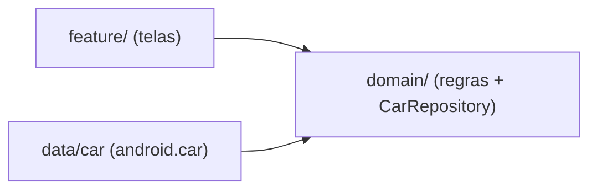

# `domain/` — regra de negócio PURA (sem android.car)

## 🧒 Em miúdos

Esta pasta é o **miolo de regras** do app: ela diz *o que* precisa acontecer, sem se
importar com *qual* carro ou *qual* tela está do outro lado. É como uma receita que lista
os ingredientes de que precisa — mas não se importa com qual mercado vai entregá-los.

> 📖 Siglas explicadas no [glossário](../docs/00-glossario.md).

**Micro:** define a interface `CarRepository` (o **contrato** com o veículo — a promessa
"é assim que se pega os dados do carro", sem dizer *como*) e *use cases* (casos de uso:
regrinhas pequenas e com nome) como `ObserveVehicleSpeed` (observar a velocidade). Nenhum
import de `android.car` (o pacote que fala direto com o hardware do carro, a Car API) aqui.

**Macro:** este é o pulo da **Clean Architecture** (arquitetura limpa — código em camadas
onde a de dentro não conhece a de fora) no automotivo. O domínio **declara** o que precisa
do carro (uma interface que devolve `Flow<VehicleSpeed>` — um fluxo que "avisa" quando a
velocidade muda), e `data/car` **implementa** usando o `CarPropertyManager` (o gerente do
sistema que lê, escreve e assina os dados do veículo). Isso é **inversão de dependência**
(o "D" de SOLID): quem manda é o contrato de dentro, não o detalhe de fora.

*Repare nas setas:* tanto `feature/` quanto `data/car` **apontam para** `domain/` — o
domínio não conhece ninguém, todos dependem dele.

Resultado: a regra roda em **teste unitário puro na JVM** (Java Virtual Machine — o motor
que roda Kotlin no seu computador, sem device) com um **fake** (um dublê: uma implementação
de mentira que finge ser o carro) — sem precisar de emulador automotivo (ver
[`docs/08`](../docs/08-testing-and-distribution.md)).

> Se você importar `CarPropertyManager` aqui, quebrou a camada. O teste vira instrumentado
> (precisa de emulador/carro em vez de rodar rapidinho na JVM).

### Palavras novas

- **CarRepository**, **Clean Architecture**, **Flow/StateFlow**, **fake**, **JVM** →
  [glossário › Arquitetura e testes](../docs/00-glossario.md#6-arquitetura-e-testes)
- **android.car**, **Car API**, **CarPropertyManager** →
  [glossário › Como o app conversa com o carro](../docs/00-glossario.md#2-como-o-app-conversa-com-o-carro)
