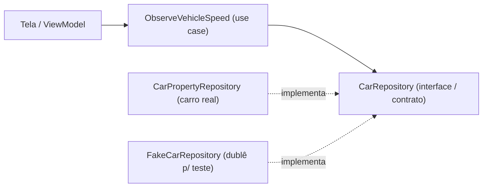

# `.../com/autodash/domain/` — o contrato e os use cases

## 🧒 Em miúdos

Esta pasta guarda **o pedido** e **a promessa**. O *use case* é o pedido ("me mostra a
velocidade"); a interface é a promessa de alguém entregar esse dado — sem dizer de que
carro ele vem. Como um cardápio: você pede o prato, sem saber quem cozinha lá atrás.

> 📖 Siglas explicadas no [glossário](../../../../../../../docs/00-glossario.md).

**Micro:** aqui moram dois tipos de arquivo, e nenhum deles importa `android.car` (o pacote
que fala direto com o hardware do carro).

- `CarRepository.kt` — a **interface** (o **contrato**: uma lista de promessas de método,
  tipo `vehicleSpeed()`, `climate()`, `setSeatTemp()`, sem o *como*). O domínio depende
  **disto**, e não do `CarPropertyManager` (o gerente do sistema que lê, escreve e assina
  os dados do veículo pela **Car API** — o balcão de comandos do carro). Quem cumpre a
  promessa de verdade é o módulo [`data/car`](../../../../../../../data/car), que traduz os
  dados crus do **VHAL** (Vehicle HAL — a "ficha técnica" das propriedades do carro:
  `RANGE_REMAINING`, `HVAC_TEMPERATURE_SET` etc.).
- `ObserveVehicleSpeed.kt` — um **use case** (caso de uso: uma regrinha pequena, com nome,
  que faz **uma** coisa). Este expõe a velocidade como `Flow<VehicleSpeed>` (um `Flow` é um
  fluxo que "avisa" toda vez que o valor muda). A tela consome o *use case*, **não** o SDK
  do carro.

**O que é uma "interface / contrato"?** É uma lista de **o que** dá pra fazer, sem **como**.
Ela não roda nada sozinha — precisa de alguém que a implemente. Aqui, quem implementa é
`CarPropertyRepository` (o carro real, em `data/car`) **ou** um `FakeCarRepository` (um
dublê de mentira, pra teste). Trocar um pelo outro **não muda uma linha** da tela.

**O que é um "use case"?** É um pedaço de regra com um nome que diz a intenção. Em vez de a
tela chamar o contrato direto, ela chama `ObserveVehicleSpeed`, que só sabe pedir a
velocidade e limpar o excesso (`distinctUntilChanged`, porque `PERF_VEHICLE_SPEED` emite o
tempo todo e a tela só precisa das mudanças).

*Repare nas setas:* a tela nunca toca no carro — ela para no *use case*, que para no
contrato. Quem entrega o dado (real ou fake) fica **atrás** da interface.

Isto é o **D** (Dependency Inversion — inversão de dependência) do **SOLID** aplicado ao
**AAOS** (Android Automotive OS — o Android que roda **dentro** do carro): quem manda é o
contrato de dentro, não o detalhe de fora.

### Palavras novas

- **use case**, **interface / contrato (CarRepository)**, **fake**, **Flow/StateFlow** →
  [glossário › Arquitetura e testes](../../../../../../../docs/00-glossario.md#6-arquitetura-e-testes)
- **AAOS**, **Car API**, **CarPropertyManager**, **VHAL** →
  [glossário › Como o app conversa com o carro](../../../../../../../docs/00-glossario.md#2-como-o-app-conversa-com-o-carro)
