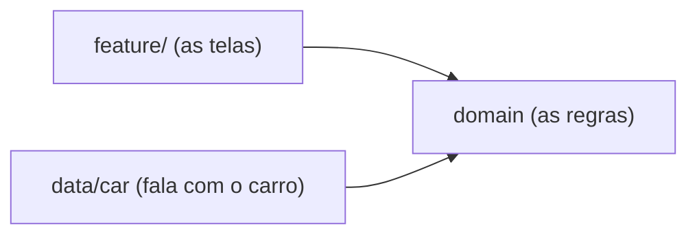

# `feature/` — as duas superfícies do app

## 🧒 Em miúdos
Pensa nesta pasta como a **vitrine** da loja: é tudo que o motorista vê e toca na tela. Ela não fala com o carro sozinha — pede tudo para os "bastidores" (a pasta `domain`) e só cuida de mostrar as coisas bonitas.

> 📖 Siglas explicadas no [glossário](../docs/00-glossario.md).

Um app de carro tem **dois tipos de tela**, e por isso a pasta `feature/` mantém cada tipo em seu próprio módulo:

- **parado** (*parked*): com o carro estacionado dá pra mostrar uma tela **rica**, cheia de detalhes. É feita com **Activity** (a "tela-container" clássica do Android) + **Compose** (Jetpack Compose — o mesmo jeito moderno de desenhar telas que você já usa no celular).
- **dirigindo** (*drivable*): com o carro andando a tela precisa ser **simples e segura**, então você **não desenha pixel**. Usa a **Car App Library** (biblioteca do Google pra apps de carro: você descreve o que mostrar e o carro desenha por você), que já entrega moldes prontos e seguros pra dirigir.

## As três telas

- [`dashboard/`](dashboard) — **telemetria** (velocidade, marcha, bateria) em Compose, no estilo **cluster** (o painel de instrumentos na frente do motorista). Tela **parada**. Consome os *use cases* (as "regras prontas" que vêm do `domain`).
- [`climate/`](climate) — controle de **HVAC** (Heating, Ventilation, Air Conditioning — o ar-condicionado/climatização do carro), com uma zona para cada assento (motorista e passageiro). Também é tela **parada**, em Compose.
- [`carapp/`](carapp) — **CarAppService** (a porta de entrada do app dirigível, registrada no manifesto) + uma **Screen** (uma tela do app de carro) que lista **POIs** (Point of Interest / Pontos de Interesse — lugares no mapa, tipo posto ou restaurante). É a superfície **dirigindo**: quem desenha na tela é o **host** (o programa do carro que renderiza os moldes).

Todas as telas dependem de `domain` (as regras do app) — e **nunca** falam com `data/car` (a pasta que conversa de fato com o carro) direto. Por isso a mesma tela funciona tanto com o carro real quanto com um dublê de teste.

### Palavras novas
- **parked / drivable**, **Compose**, **Car App Library**, **CarAppService / Screen / host** — [glossário](../docs/00-glossario.md)
- **POI**, **HVAC**, **cluster** — [glossário](../docs/00-glossario.md)
