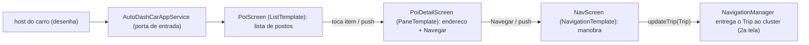

# `feature/carapp/` — POI dirigível (Car App Library)

## 🧒 Em miúdos
Aqui o app **não pinta** a tela do carro. Ele preenche um "formulário" dizendo o que mostrar — uma lista de lugares, um detalhe, uma rota — e o próprio carro imprime no padrão dele, já pronto pra usar dirigindo. É como pedir num balcão: você diz o pedido, a cozinha entrega no prato da casa.

> 📖 Siglas explicadas no [glossário](../../docs/00-glossario.md).

**Micro:** `AutoDashCarAppService` é o **ponto de entrada** (a "porta") registrado no `AndroidManifest` (o documento de identidade do app) na categoria **POI** (Point of Interest / Ponto de Interesse — um lugar no mapa: posto, restaurante, carregador). `PoiScreen` devolve um `ListTemplate` (um dos moldes de tela prontos) com esses pontos.

**Macro — templates dirigíveis (ver [`docs/03`](../../docs/03-car-app-library.md)):**
Esta pasta usa a **Car App Library** (biblioteca pra fazer app de carro **sem desenhar pixel**: você descreve a tela e o carro renderiza).

- Você **não desenha pixels**: descreve o **template** (o molde: lista, detalhe, navegação) e o **host** (o programa do carro que desenha os templates) renderiza.
- O mesmo `CarAppService` roda em **AAOS** (Android Automotive OS — o Android que *é* o carro) **e** em **Android Auto** (o celular projetando a tela no painel).
- **Restrições**: a lista é curta (o host limita a quantidade de itens em movimento, via `ConstraintManager`, pra não distrair) e a navegação é rasa. Aqui a UI (a interface, as telas) já nasce segura para dirigir.

> Contraste com o `dashboard`: aquele é Compose/Activity (tela desenhada em código, usada só com o carro **estacionado**); este é template (**dirigível**). É a mesma app, com duas superfícies.

## Navegável (ListTemplate → PaneTemplate → NavigationTemplate)

O fluxo tem três telas, cada uma devolvendo um molde diferente. `ScreenManager` (a **pilha** de telas) empilha e volta:

- `PoiScreen` (**ListTemplate**): a lista de POIs. Tocar num item empilha o detalhe (`ScreenManager.push`).
- `PoiDetailScreen` (**PaneTemplate** — molde de detalhes): endereço/distância + a ação **"Navegar"**, que empilha a `NavScreen`. O botão BACK volta (`ScreenManager.pop`).
- `NavScreen` (**NavigationTemplate** — molde de mapa + rota): mostra a manobra atual (o "vire à direita"). Ele entrega um **`Trip`** (a viagem: destino + passo + ETA, o horário estimado de chegada) ao **`NavigationManager`** (o gerente de navegação da Car App Library), que é o que o host projeta no **cluster** (o painel de instrumentos na frente do motorista, a 2ª tela).
- `Poi.kt`: o dado (com teste `PoiTest`).

Fluxo raso e lista curta por causa da distração ao dirigir (ver [`docs/03`](../../docs/03-car-app-library.md) + [`docs/05`](../../docs/05-ux-restrictions.md)).

## Teste

`PoiScreenTest` roda o template **sem carro real**: usa `TestCarContext`, da biblioteca `car.app:app-testing` (as ferramentas oficiais para testar `Screen`/`Template`), rodando sobre **Robolectric** (roda o Android direto no PC, sem emulador). Assim dá para conferir que cada tela devolve o molde certo (`ListTemplate`, `PaneTemplate`, `NavigationTemplate`) com um `./gradlew test`.

### Palavras novas
- **Car App Library** · **Template** (ListTemplate / PaneTemplate / NavigationTemplate) · **host** · **POI** — [glossário › Telas e segurança dirigindo](../../docs/00-glossario.md#3-telas-e-segurança-dirigindo)
- **AAOS** · **Android Auto** — [glossário › O panorama](../../docs/00-glossario.md#1-o-panorama-onde-o-app-roda)
- **Robolectric** · **JVM** · **cluster** — [glossário › Arquitetura e testes](../../docs/00-glossario.md#6-arquitetura-e-testes)
