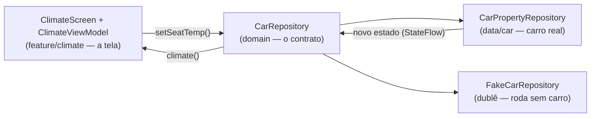

# `feature/climate/` — HVAC por ZONA (Car API na prática)

## 🧒 Em miúdos

Esta pasta é a **tela do ar-condicionado** do carro. Como o motorista e o passageiro podem querer
temperaturas diferentes, cada lado é um controle separado — igual a duas torneiras de chuveiro, uma
para cada pessoa.

> 📖 Siglas explicadas no [glossário](../../docs/00-glossario.md).

**Micro (o que esta pasta faz):** o `ClimateViewModel` é o "cérebro" da tela (padrão **MVVM** —
Model–View–ViewModel, que separa a tela da lógica). Ele lê o estado do clima por `car.climate()`, que
devolve um **StateFlow** (um valor que avisa sozinho quando muda), e manda as mudanças — os *deltas*,
ou seja, quanto subir/descer. O `ClimateScreen` é a tela em si: mostra **duas zonas** (motorista e
passageiro), cada uma com botões +/- de temperatura. Aqui "clima" é o **HVAC** (Heating, Ventilation,
Air Conditioning — o ar-condicionado/climatização do carro).

**Como esta pasta se liga no resto:**

**Macro — a Car API "por zona"** (a **Car API** é o "balcão de atendimento" por onde o app fala com o
carro; ver [`docs/02`](../../docs/02-car-api-and-vhal.md)):

- `HVAC_TEMPERATURE_SET` é uma **propriedade** (um dado/controle do carro, com nome fixo) que existe
  **por assento** — ou seja, por **zona** (`areaId`, que diz "qual lugar"). Cada zona usa um valor de
  `VehicleAreaSeat` (`SEAT_ROW_1_LEFT` = motorista, `SEAT_ROW_1_RIGHT` = passageiro). Mudar o
  motorista **não** mexe no passageiro.
- **Escrever** (o que o +/- faz) chama `setProperty`, que exige a permissão **`CONTROL_CAR_CLIMATE`**.
  Essa permissão é do tipo **`signature|privileged`** — só a conseguem apps assinados com a chave do
  sistema **ou** que estejam numa lista aprovada pela **OEM** (a montadora); ver
  [`docs/04`](../../docs/04-permissions-privileged.md). No **Fake** (um dublê que roda sem o carro) e
  no emulador funciona sem isso; num carro real, depende do acordo com a montadora.
- Fluxo completo: botão → `ViewModel.delta` → `CarRepository.setSeatTemp(seat, temp)` (o
  **CarRepository** é o contrato "é assim que se fala com o carro") → `climate()` reemite o novo
  estado → a tela (UI) se redesenha. A UI **não** conhece o `CarPropertyManager` (o gerente que de
  fato lê e escreve no carro): esse é o princípio da **Clean Arch** (Clean Architecture — código em
  camadas, onde a tela não sabe os detalhes do carro).

**Responsivo e white-label:** a tela usa `BoxWithConstraints` (mede o espaço disponível e adapta o
layout) e lê cor/tipografia dos **tokens** (valores de estilo com nome, que trocam a marca sem mexer
no código) — nunca cores cruas.

**UX (padrões automotivos):**
- **POWER** e **A-C** são `Switch` do Material3 com **status On/Off** + ícone — feedback claro do
  estado (ligado/desligado).
- O +/- de temperatura e o **FAN** (ventilação) usam `FilledIconButton` com alvo de toque **≥64dp**
  (`dp` = unidade de tela independente da densidade; o alvo é grande porque se toca dirigindo), com
  ripple (o efeito visual de toque) e `contentDescription` para o **TalkBack** (o leitor de tela do
  Android, para quem não enxerga).
- **POWER desligado desabilita e apaga** as zonas, o A-C e o FAN — isso se chama **gating** (um
  controle "mestre" que trava os demais).

**Testes:**
- `ClimateViewModelTest` (teste **unit** — rápido, na sua máquina, com `coroutines-test`) cobre
  `togglePower/toggleAc/fan/delta`, os *clamps* (os limites: fan de 0 a 6, temperatura de 16 a 28) e a
  independência por zona.
- `ClimateSnapshotTest` usa **Paparazzi** (tira uma "foto" da tela na máquina e compara com a foto
  aprovada) — tem o clima por marca + `climate_power_off`/`climate_ac_off` (prova visual do gating).

### Palavras novas

- **HVAC** (Heating, Ventilation, Air Conditioning) — o ar-condicionado/climatização do carro — [glossário](../../docs/00-glossario.md)
- **Car API** — o "balcão" por onde o app fala com o carro — [glossário](../../docs/00-glossario.md)
- **MVVM** (Model–View–ViewModel) — separa tela, lógica e dados — [glossário](../../docs/00-glossario.md)
- **StateFlow** — valor que avisa quando muda — [glossário](../../docs/00-glossario.md)
- **Zona / `areaId`** — controle por lugar (motorista ≠ passageiro) — [glossário](../../docs/00-glossario.md)
- **CarRepository** — o contrato para pegar/mudar dados do carro — [glossário](../../docs/00-glossario.md)
- **CarPropertyManager** — o gerente que de fato lê/escreve no carro — [glossário](../../docs/00-glossario.md)
- **`signature|privileged` / OEM** — permissão sensível liberada pela montadora — [glossário](../../docs/00-glossario.md)
- **Clean Architecture** — código em camadas (a tela não conhece o carro) — [glossário](../../docs/00-glossario.md)
- **Paparazzi** — teste de "foto" de tela (snapshot) — [glossário](../../docs/00-glossario.md)
