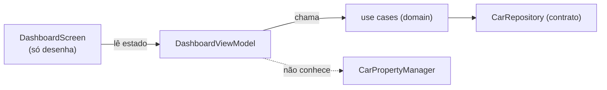

# `feature/dashboard/` — telemetria em Compose (parked)

## 🧒 Em miúdos
Esta pasta desenha o **painel de instrumentos** do carro — o velocímetro, o nível de bateria e a
marcha que ficam bem na frente do motorista. É a mesma ideia dos mostradores atrás do volante, só
que pintados na tela.

> 📖 Siglas explicadas no [glossário](../../docs/00-glossario.md).

**Micro:** o `DashboardViewModel` (a peça do **MVVM** — *Model-View-ViewModel* — que prepara o
estado pronto pra tela) junta os *use cases* (`ObserveVehicleSpeed`, marcha, energia — cada um é uma
regrinha do módulo `domain`) e publica um `StateFlow` (um valor que **avisa sozinho quando muda**; a
tela assina e se redesenha). O `DashboardScreen` só **lê** esse estado e desenha velocímetro, marcha
e energia — ele nunca conversa direto com o carro.

**Macro:**
- **MVVM + UDF** (*Unidirectional Data Flow* — os dados fluem num sentido só: comando desce, estado
  sobe): a UI só lê estado e **não conhece** o `CarPropertyManager` (o gerente que lê os dados do
  carro). Ela fala com o *use case*, e o *use case* fala com o carro.
- **CarUxRestrictions** (*Car UX Restrictions* — as regras de segurança que o carro impõe à tela
  **enquanto anda**: menos texto, sem vídeo) — ver [`docs/05`](../../docs/05-ux-restrictions.md):
  esta tela é rica **parado**; em movimento o sistema manda enxugar. O gancho de restrição entraria
  aqui.
- Colete com `collectAsStateWithLifecycle` (assina o `StateFlow` só enquanto a tela está viva). A
  tela do carro fica ligada muito tempo; coletar sem olhar o ciclo de vida desperdiça energia (o
  **head unit** — o computador+tela do painel — vive sempre aceso).

## i18n / l10n
**i18n / l10n** = *internacionalização* / *localização*: adaptar a tela ao idioma e à região do
aparelho **sem `if` no código**.
- **Unidade por região:** `res/values/bools.xml` (métrico) e `res/values-en-rUS|GB/bools.xml`
  (imperial) → o app mostra **km/h** ou **mph** conforme o **locale** (o idioma/região do device,
  ex.: pt-BR, en-US), sem `if` no código. A mesma regra está espelhada em
  `core/model/unitSystemForLocale()` (com teste `UnitsTest`).
- **Rótulos:** `res/values/strings.xml` (pt) + `res/values-en/strings.xml` (en). A UI usa
  `stringResource(...)`. Ver [`docs/09`](../../docs/09-whitelabel-responsive.md).
- Provado em device (emulador en-US → 36 mph / English) e por *snapshot* **Paparazzi** (ferramenta
  que desenha a tela na sua máquina e salva uma **foto** pra comparar) — o *golden*
  `english_imperial_slate`. `res/` não tem README (o `aapt` exige só XML) — descrito aqui.

## Redesign (cluster HUD)
Tela reconstruída como um **cluster** (o painel de instrumentos na frente do motorista) com visual
**HUD** (*Head-Up Display* — números grandes, alto contraste; aqui é só o **estilo**, não um projetor
real), não um app genérico:
- **Speedometer** (velocímetro) e **anel de bateria** desenhados no `Canvas` (a ferramenta do
  Compose pra pintar ponto a ponto: arco + ticks + glow) — cara de engenharia, não de template.
- **Seletor P-R-N-D** (as marchas *Park-Reverse-Neutral-Drive*), cards de **autonomia/temperatura/
  modo**, header com marca + status LIVE.
- **Responsivo por medida real:** `BoxWithConstraints` mede o espaço e a função `isWide(w, h)`
  decide o layout largo (paisagem) ou estreito (retrato) — provado sem device pelo `ResponsiveTest`.
- **Dia/noite:** a tela **não** aplica tema; ela lê as cores do tema que o *host* aplica
  (`AutoDashTheme`), então claro/escuro vêm de fora sem tocar no layout.
- Fonte **Chakra Petch** (a cara HUD, licença SIL OFL) em `core/designsystem/res/font`.
- **White-label de verdade** (*marca branca*: um só código-base vira o app de várias montadoras):
  a marca é fixa por build (não há botão "trocar marca"); cor e tipografia vêm dos *tokens*. A i18n
  mantém km/h×mph, km×mi, °C×°F por locale.

**Testes:** `DashboardViewModelTest` (unit, `coroutines-test` — o kit que troca o tempo das
corrotinas por um **relógio de mentira** que você adianta na mão) prova o MVVM: o VM mapeia os sinais
do repo para o `StateFlow` de UI. Usa `runCurrent()` (roda só o que já está pronto) e **não**
`advanceUntilIdle()` (que roda até "esvaziar a fila") porque os fluxos do *fake* são infinitos
(`while(true){emit;delay}`) e nunca esvaziam. `DashboardSnapshotTest` (Paparazzi) trava o visual por
marca + portrait + inglês/imperial + tema claro.

### Palavras novas
- [MVVM / UDF](../../docs/00-glossario.md) · [StateFlow](../../docs/00-glossario.md) · [CarPropertyManager](../../docs/00-glossario.md)
- [CarUxRestrictions](../../docs/00-glossario.md) · [head unit](../../docs/00-glossario.md) · [cluster](../../docs/00-glossario.md) · [HUD](../../docs/00-glossario.md)
- [Canvas](../../docs/00-glossario.md) · [Paparazzi / snapshot / golden](../../docs/00-glossario.md) · [white-label](../../docs/00-glossario.md) · [i18n / l10n / locale](../../docs/00-glossario.md)
