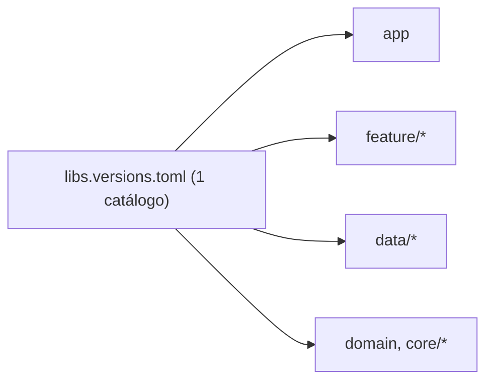

# `gradle/`

## 🧒 Em miúdos

Esta pasta guarda a **lista de compras** de versões do projeto: um único lugar que diz "a
gente usa a biblioteca X na versão Y". Todos os pedaços do app olham para essa mesma lista,
então ninguém acaba usando uma versão diferente por engano.

> 📖 Siglas explicadas no [glossário](../docs/00-glossario.md).

**Micro:** guarda o `libs.versions.toml` — o **Version Catalog** (catálogo de versões: um
arquivo único onde ficam **os nomes e as versões** de todas as bibliotecas e plugins do
projeto). Em vez de cada módulo escrever `"1.8.1"` na mão, todos apontam para o mesmo apelido
(ex.: `libs.kotlinx.coroutines`) e a versão vem daqui.
(O **wrapper** — `gradle-wrapper.properties`, o arquivo que fixa **qual versão do próprio
Gradle** o projeto usa — também moraria aqui num projeto gerado pelo Studio.)

**Macro:** num app **multi-marca** (white-label — um só código-base que vira o app de várias
montadoras), dezenas de módulos compartilham as mesmas libs. Centralizar as versões evita
*dependency hell* (o "inferno das dependências": módulos ou marcas puxando versões
conflitantes da mesma lib, até nada compilar). Um catálogo = **uma fonte única da verdade**
para versões. Ver [`docs/06`](../docs/06-multi-brand-rro.md).

*Uma seta por módulo:* todos leem as versões do mesmo arquivo — mudou aqui, mudou em todo lugar.

### Palavras novas

- **white-label**, **flavor** (a variação do app por marca) →
  [glossário › Cara da marca](../docs/00-glossario.md#5-cara-da-marca-white-label)
